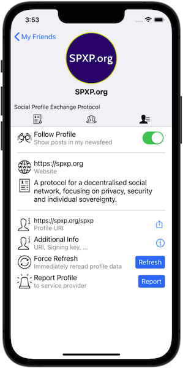

# Social Profile Exchange Protocol

A protocol for a decentralised social network, focusing on privacy, security and individual sovereignty.

Designed after the principles of the world wide web, adding strong end-to-end cryptography to push
power from the network into endpoint devices.

If you want to play with it and see it in action ASAP, take a look at our [Quickstart](./Quickstart.md).

## How it works

Similar to the world wide web, a social profile is described by a simple text file in JSON format:

`https://spxp.org/spxp`
```json
{
    "ver": "0.3",
    "name": "SPXP.org",
    "shortInfo": "Social Profile Exchange Protocol",
    "about": "A protocol for a decentralised social network, focusing on privacy, security and individual sovereignty.",
    "website": "https://spxp.org",
    "profilePhoto": "spxp-profile-logo.png",
    "postsEndpoint": "spxp-posts"
}
```

To participate, use a client like the [HeyFolks app](https://heyfolks.app) to display these files and navigate the social graph:



As a **publisher**, you can eliminate the network between you and the reader. Nobody inbetween will alter your content or rate its importance.
Even more important, your content resides on your server under your control. You do not need to grant anybody a license for your content.

As a **reader**, you can participate immediately without setting up a profile - just like browsing the world wide web. You have fulll control
*what* you see, and *how* you want to consume it.

To guarantee **authenticity and sovereignty**, a publisher can optionally *sign* all information. The profile is then bound to the *public key*
rather than the URI, allowing the publisher to move to a different server or provider without friction.

To guarantee **privacy**, individual information can be *encrypted* allowing a profile to restrict individual bits of information to a limited audience. 

This cryptographic process is described in detail in [this video](https://www.youtube.com/watch?v=C0S0Oa4G1M4).

## Protocol Family

* **Social Profile Exchange Protocol - SPXP**  
  The core protocol defining how clients can retrieve information from protocol servers, validate the information and participate in the connection handshake.  
  Released version: [0.3](https://github.com/spxp/spxp-specs/blob/v0.3/SPXP-Spec.md), working draft: [0.4](./SPXP-Spec.md)

* **SPXP Profile Management Extension - SPXP-PME**  
  Protocol extension defining how clients can manage a protocol server which is hosting their own profile.  
  Released version: [0.3](https://github.com/spxp/spxp-specs/blob/v0.3/SPXP-PME-Spec.md), working draft: [0.4](./SPXP-PME-Spec.md)

* **SPXP Service Provider Extension - SPXP-SPE**  
  Extension defining a secure setup process for new profiles between a client and a service provider.  
  Released version: [0.3](https://github.com/spxp/spxp-specs/blob/v0.3/SPXP-SPE-Spec.md), working draft: [0.4](./SPXP-SPE-Spec.md)

## Implementations
Server:
* [Wordpress Plugin](https://wordpress.org/plugins/hfa-spxp-support/) to expose your blog via SPXP (GPL license)
* A [Simple PHP Server](https://github.com/spxp/simple-php-server) supporting the entire protocol family (Apache license)
* and you can always create a profile manually and throw it on any web server

Clients:
* [HeyFolks app](https://heyfolks.app) a mobile client for iOS and Android (commercial license)
* [spxp-cli](https://github.com/spxp-space/spxp-cli) a client to manage your profile implemented as a single plain bash script (supports the [Service Provider](https://github.com/spxp/spxp-specs/blob/master/SPXP-SPE-Spec.md) and the [Profile Management Extension](https://github.com/spxp/spxp-specs/blob/master/SPXP-PME-Spec.md))
* and you can always use `curl` and `jq` manually

Service provider:
* [spxp.space](https://spxp.space) a commercial SPXP hosting provider supporting the entire protocol family
* and you can always set up your own hosting service using the simple PHP server above

## Get your hands dirty and play with this protocol
If you want to see it in action and learn more about this protocol, here are some suggestions for next steps:

1. Take a look at our [Quickstart](./Quickstart.md) guide walking you through the protocol essentials and some of the steps below
2. Visit the [SPXP Bridge](https://bridge.spxp.org) and see how ActivityPub, AT Protocol and Nostr are translated to SPXP  
   (Best explored with Firefox as it renders json nicely)
3. If you want to see more sophisticated profiles using encryption and signing, take a look at some [testbed profiles](http://testbed.spxp.org/0.3/)  
   For example this [profile](http://testbed.spxp.org/0.3/heavyfrog799), it's [posts](http://testbed.spxp.org/0.3/posts/_read-posts.php?profile=heavyfrog799) and [friends](http://testbed.spxp.org/0.3/friends/heavyfrog799)
4. Install the [HeyFolks app](https://heyfolks.app) and explore some bridge or testbed profiles to see the end user experience
5. Manually create a simple profile with a plain text editor, put it on your web server and open it with the HeyFolks app
6. Set up your own profile in the HeyFolks app on spxp.space
7. Take a deeper look at the cryptographic operations by [manually creating a signed and encrypted profile](https://github.com/spxp/spxp-crypto/blob/master/spxp-crypto-tools/ManualProfileCreation.md)
8. Deploy the simple php server and run your own spxp hosting service
9. Use the spxp-cli to create test profile(s) on your own hosting service or spxp.space
10. Send a connection request with the spxp-cli to your profile in the HeyFolks app and accept it to see additional content

## Why don't you just use...
A common and very relevant question.

We have prepared a [comparsion with other protocols](./info/Comparison.md) investigate the differences and discuss how these do or do not fulfil our design goals.

## Development resources
In addition to the protocol spec in this repository, you might find these additional resources helpful.

#### Testbed profiles
We provide sets of artificially generated profiles on [testbed.spxp.org](http://testbed.spxp.org) for all protocol versions. These can be used to
develop new client applications and validate your implementation against different test sets. The [generator](https://github.com/spxp/spxp-testbed-generator)
for these profiles is available as well under Apache license.

#### SDK / Reference implementation
There are already numerous libraries out there for HTTP communication and JSON handling - the two main foundation
blocks of SPXP. We think providing an SDK that would depend on one of these would interfere too much with most
projects or developer preferences.
The situation however is different for the cryptographic operations in SPXP. The [spxp-crypto](https://github.com/spxp/spxp-crypto)
library provides a reference implementation in Java as well as a standard library that can be used directly in your
projects.

#### Commandline tooling
For most operations, `curl` and `jq` are sufficient. For cryptographic operations, we provide the
[SpxpCryptoTool](https://github.com/spxp/spxp-crypto/blob/master/spxp-crypto-tools/README.md)
which can be used on the command line or from scripts.
With this tool, you can [explore the testbed profiles](https://github.com/spxp/spxp-crypto/blob/master/spxp-crypto-tools/ExploreTestbedProfiles.md)
from the command line.

## Compared to other protocols
Multiple other protocols for decentralised social networks have been proposed over time. It is worth comparing SPXP against a selection
of popular alternatives, investigate the differences and discuss why these do not fulfil the design goals of SPXP (privacy, security and
individual sovereignty).

### ActivityPub (gnuscial, Mastodon, Pleroma, Pixelfed, etc)
[ActivityPub](https://www.w3.org/TR/2018/REC-activitypub-20180123/) uses a federated architecture where users need to create an account
on one of multiple available instances. Data, like profile information or individual posts, is replicated as needed between instances.
* Your ID is bound to the instances domain
* You don't have full control over your own profile  
  Instance owners can close and delete your profile at any time at their sole discretion - and sometimes even close the entire instance.
  All your data and connections will be lost, at least until your last manual backup. Profile migrations are an afterthought and only possible
  if the instance owner collaborates.  
  This is a violation of the *individual sovereignty* we are interested in.
* You don't have full control over your own timeline.   
  Instance owners block content from other instances at their sole discretion. Accounts on blocked instances will not be able to interact
  with you and you won't even see their content. This content moderation has some positive impacts, e.g. for blocking spam and fighting harassment.  
  However, since you don't have control over this content moderation, it is a violation of the *individual sovereignty* we are interested in.
* The authenticity of your data is not guaranteed  
  Without real end-to-end digital signatures, it is possible to tamper with existing messages or completely forge them.  
  This is a violation of the *security* we are interested in.
* Your data is fully accessible by instance owners  
  This includes absolutely everything and is a severe violation of the *privacy* we are interested in.
* You cannot control how your content is used  
  As a federated protocol, it requires that your data is replicated between different instances, and you have no control over this mechanism. Other
  instances in the Fediverse will display your content on their website, under their own terms and under their exclusive control.  
  This is a violation of the *individual sovereignty* we are interested in.
* You cannot limit the visibility of your content  
  There is some content you are happy to share with the whole world. But there might be other content you only want to share with your
  friends or your family. This is not supported in ActivityPub. Everything is publicly visible (except DNs).  
  This does not provide the level of *privacy* we are interested in.

### AT Protocol (Bluesky)
The [AT Protocol](https://atproto.com/docs) is very similar to ActivityPub and again using a federated architecture. Although there are
technical differences, the same findings as above apply here as well:
* The handle is bound to a DNS domain
* There is no end-to-end message encryption
* Personal Data Servers (PDS) owners have access to all data and can block interactions
The AT protocol is pretty new and is [currently seeing a lot of changes](https://github.com/bluesky-social/atproto/commits/main). It is
possible that the above analysis is no longer accurate. We will try to keep up with the recent developments and update this section accordingly.

### Nostr
[Nostr (Notes and Other Stuff Transmitted by Relays)](https://github.com/nostr-protocol/nostr) is an interesting candidate. It solves many
of our requirements in a quite similar manner. However, it only provides public posts and does not go as far as SPXP in terms for privacy
and sovereignty matters:
* Profiles are bound to a cryptographic keypair rather than a domain, making them portable
* Events are end-to-end signed, guaranteeing message authenticity
* All messages are public, except for direct messages.
