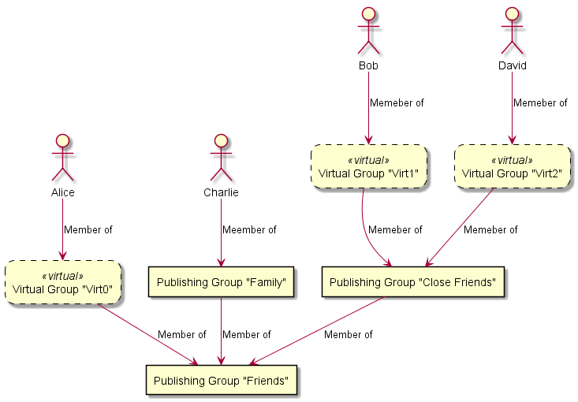

# Social Profile Exchange Protocol Specification
Version 0.3

## 1 Social profile

### 1.1 Cryptographic profile key pair
Every social profile is uniquely identified by an asymmetric cryptographic key pair. SPXP uses the
[Ed25519](http://ed25519.cr.yp.to/) signature algorithm for data authenticity and the corresponding public key as unique
identifier of a profile.  
Although this protocol allows profiles without a signing key, using one is highly recommended.

### 1.2 Profile URI
Every social profile is addressed by an _absolute URI_ as defined in [RFC 3986 Section 4.3](https://tools.ietf.org/html/rfc3986#section-4.3).
Every protocol client must support at least the scheme “https” and can choose to additionally support the scheme “http”
and others.

### 1.3 Unique profile identification
The cryptographic key takes precedence over the URI. Two profiles published under different URIs but using the same
cryptographic key must be considered identical. Data signed with different cryptographic keys delivered by the same URI
must be treated as different profiles.  
If a profile client detects a change in the signing key used by the profile behind a URI, it has to warn the user and
must not present the data signed by different keys as belonging to the same profile.  

## 2 Communication protocols
Data is exchanged between participating clients and servers via HTTP, preferably over TLS (i.e. HTTPS). Clients and
servers are encouraged to use the latest versions of these protocols, e.g. HTTP/2 and HTTP/3 and to prefer IPv6.

## 3 Transport encoding of structured data
Data is encoded as JSON according to [RFC 7519 “The JavaScript Object Notation (JSON) Data Interchange
Format”](https://tools.ietf.org/html/rfc7159). Please note that this standard defines the HTTP “Content-Type” header to
be “application/json” with no “charset” parameter. Clients must always use UTF-8 character encoding, irrespective of any
“charset” incorrectly sent by the server.  
The term ”Base64Url” throughout this specification refers top the URL safe Base 64 Encoding as apecified in [RFC 4648
Section 5](https://tools.ietf.org/html/rfc4648#section-5) without padding.

## 4 Protocol versioning
This protocol uses [Semantic Versioning](https://semver.org/). This document specifies protocol version is “0.3”.

## 5 Social profile root document
Protocol servers respond to requests for the social profile URI with the social profile root document. This JSON object
contains the following members:

| Name | Type | Mandatory | Description |
|---|---|---|---|
| ver | String | required | Version of the SPXProtocol exposed by this URI. <br/> This specification is defining version “0.3” |
| name | String | required | The display name of this profile |
| about | String | optional | Additional description of this profile |
| gender | String | optional | Free text string specifying the gender of this profile. Clients should recognize the english text strings “female” and “male” and display localized text or icons. All other content can be displayed as-is. |
| website | String | optional | URI of the profile’s website |
| email | String | optional | Email address of this profile |
| birthDayAndMonth | String | optional | String of the format “dd-mm” with “dd” being a numeric value 1-31 and “mm“ being a numeric value 1-12 specifying the day and month of birth of this profile in the Gregorian calendar |
| birthYear | String | optional | String containing a positive numeric integer specifying the year of birth of this profile in the Gregorian calendar |
| hometown | String | optional | Social profile URI of the profile's hometown |
| location | String | optional | Social profile URI of the profile's current location |
| coordinates | Object | optional | Object containing two members with numeric values “latitude” and “longitude” specifying the profiles current position in signed degrees format in the WGS84 geodetic system. <br/> Latitude ranges from -90 to +90 and longitude ranges from -180 to +180. |
| profilePhoto | String <br/> or <br/> Object | optional | String containing a _URI-reference_ as defined in [RFC 3986 Section 4.1](https://tools.ietf.org/html/rfc3986#section-4.1) pointing to a resource holding a profile photo. Clients should at least support images in JPEG and PNG format. <br/> or <br/> JSON object holding decryption details and the location of an encrypted profile photo resource. (see [chapter 6](#6-encrypted-resources)) |
| friendsEndpoint | String | optional | _URI-reference_ as defined in [RFC 3986 Section 4.1](https://tools.ietf.org/html/rfc3986#section-4.1) pointing to the “friends endpoint” as specified in [chapter 8](#8-friends-endpoint) |
| postsEndpoint | String | optional | _URI-reference_ as defined in [RFC 3986 Section 4.1](https://tools.ietf.org/html/rfc3986#section-4.1) pointing to the “posts endpoint” as specified in [chapter 9](#9-posts-endpoint) |
| keysEndpoint | String | optional | _URI-reference_ as defined in [RFC 3986 Section 4.1](https://tools.ietf.org/html/rfc3986#section-4.1) pointing to the “keys endpoint” as specified in [chapter 11.2](#112-keys-endpoint) |
| publicKey | Object | optional | JSON object describing the public key of the profile's key pair as JWK defined in [RFC 7517 “JSON Web Key (JWK)”](https://tools.ietf.org/html/rfc7517) using the Ed25519 curve specifier as defined in [RFC 8037 Section 3.1](https://tools.ietf.org/html/rfc8037#section-3.1). <br/> Must have a unique, random key id (“kid”) |
| connect | Object | optional | Additional details for connection process, if and only if this object accepts connection requests as specified in [chapter 13](#13-profile-connections) |
| private | Array | optional | Array of private data as specified in [chapter 10](#10-private-data) |

**TODO: Connection process**

Example:
```json
{
    "ver" : "0.3",
    "name" : "Crypto Alice",
    "about" : "I love cryptography.",
    "gender" : "female",
    "website" : "https://en.wikipedia.org/wiki/Alice_and_Bob",
    "email" : "cryptoalice@example.com",
    "birthDayAndMonth" : "04-04",
    "birthYear" : "1977",
    "hometown" : "https://example.com/spxp/emerald.city",
    "location" : " https://hill-valley.example.com/profile",
    "coordinates" : {
        "latitude" : "-42.1604",
        "longitude" : "-23.4637"
    },
    "profilePhoto" : " https://images.example.com/alice.jpg",
    "friendsEndpoint" : "friends/alice",
    "postsEndpoint" : "posts?profile=alice",
    "publicKey": {
        "kty": "OKP",
        "crv": "Ed25519",
        "kid": "ZUpNLu0Dc7u2ENdmKX",
        "x": "11qYAYKxCrfVS_7TyWQHOg7hcvPapiMlrwIaaPcHURo"
    },
    "connect": {
        XXXXXXXXXXXXXXXXXXXXXXXXXXXXXXXXXXXXXXXXXXXXXXXXXXXXXXXXXXXXXXXX
    }
}
```

## 6 Encrypted resources
External resources, like images and videos, can be encrypted with the decryption key being stored as a JSON object
describing the resource. Encryption is performed with 256 bit AES in Galois/Counter Mode. The object holding the
decryption information has these members:

| Name | Type | Mandatory | Description |
|---|---|---|---|
| iv | String | required | Base64Url encoded random initialisation vector (96 bit) |
| k | String | required | Base64Url encoded octet key (256 bit) |
| tag | String | required | Base64Url encoded message authenticity tag (128 bit) |
| uri | String | required | _URI-reference_ as defined in [RFC 3986 Section 4.1](https://tools.ietf.org/html/rfc3986#section-4.1) pointing to a resource containing the encrypted data |

This object format is inspired by JWE, but does not follow this standard.  
Example of a profile with an encrypted profile photo:
```json
{
    "name" : "Crypto Alice",
    "profilePhoto": {
        "iv": "7Y_F7cQWZA-PYoMn",
        "k": "qgWVB5SupcdvHARM60knXv8h6tI2unD3GjhsPRKvT_I",
        "tag": "lN19Pd0PrGmIWWp26NctcQ",
        "uri": "images_enc/alice.encrypted"
    }
}
```

## 7 Data authenticity
JSON objects can be signed with a method that is designed after [JSON signatures in the matrix protocol
specification](https://matrix.org/docs/spec/appendices#signing-json), but which is slightly different. If a profile
exposes an Ed25519 public key as part of the profile root document, all information transmitted through SPXP has to be
signed with this key to be considered authentic. A protocol client must not present any information to the user in the
context of this profile that has not been signed by the announced profile key.

### 7.1 Signing JSON objects
To sign an object, the “private” and “seqts” member fields are removed, it is converted into [Canonical JSON](#711-canonical-json),
converted to a byte stream using UTF-8 character encoding and then signed with the profile key pair
([1.1](#11-cryptographic-profile-key-pair)) using the [Ed25519](http://ed25519.cr.yp.to/) signature algorithm. The
resulting signature is then embedded into the JSON object as “signature” object with the following members:

| Name | Type | Mandatory | Description |
|---|---|---|---|
| key | String <br/> or <br/> Object | required | Contains either the key id (“kid”) of the profile key pair ([1.1](#11-cryptographic-profile-key-pair)) as String or a certificate chain of an authorized signing key as defined in [chapter 7.2](#72-authorized-signing-keys) |
| sig | String | required | Base64Url encoded Ed25519 signature |

Example:
```json
{
    "ver" : "0.3",
    "name" : "Crypto Alice",
    "about" : "I love cryptography.",
    "website" : "https://en.wikipedia.org/wiki/Alice_and_Bob",
    "publicKey": {
        "kty": "OKP",
        "crv": "Ed25519",
        "kid": "ZUpNLu0Dc7u2ENdmKX",
        "x": "11qYAYKxCrfVS_7TyWQHOg7hcvPapiMlrwIaaPcHURo"
    },
    "signature": {
        "key": "ZUpNLu0Dc7u2ENdmKX",
        "sig": "ALK3RqZrk5XrNpeyOwr2LfUgY5qFwiIjSef8YAbl03V5"
    }
}
```
**NOTE: SIGNATURE NOT VALID IN THIS EXAMPLE**  
The plaintext of each encrypted object in the “private” array must be signed individually before being encrypted.

#### 7.1.1 Canonical JSON
Canonical JSON is the shortest serialization with lexicographically sorted members in objects. This means in particular:
1. All insignificant whitespace outside of Strings is removed
2. Members in objects are lexicographically sorted based on their key by unicode codepoint
3. Escaping in strings is limited to ```\"```, ```\\```, ```\t```, ```\b```, ```\n```, ```\r```, ```\f``` and all codepoints less than 32 encoded by ```\u####``` 

### 7.2 Authorized signing keys
A profile can authorize other keys to publish information as part of the profile. In this case, the profile issues a
certificate that combines the authorized public key with a grant, and then signs this object. This certificate is a JSON
object with the following members:

| Name | Type | Mandatory | Description |
|---|---|---|---|
| publicKey | Object | required | JSON object describing the public key of the profile's key pair as JWK defined in [RFC 7517 “JSON Web Key (JWK)”](https://tools.ietf.org/html/rfc7517) using the Ed25519 curve specifier as defined in [RFC 8037 Section 3.1](https://tools.ietf.org/html/rfc8037#section-3.1). <br/> Must have a unique, random key id (“kid”) |
| grant | Array | required | Array of Strings identifying the operations that this key pair is allowed to perform |

This certificate object must be signed as defined in [chapter 7.1](#71-signing-json-objects). Since the key of this
signature can be a certificate again, it is possible to chain multiple certificates. The end of this chain must be the
profile key pair ([1.1](#11-cryptographic-profile-key-pair)).  

Valid “grant” values are (case sensitive):

| Grant | Allows to sign |
|---|---|
| post | Individual post objects. If not combined with “impersonate”, then only in their own name. |
| comment | Comments to posts. If not combined with “impersonate”, then only in their own name. |
| friends | Data published on the friends endpoint |
| grant | Other certificates, if these do not grant permissions that exceed the permissions on this certificate, except the permissions “grant” and “ca” |
| ca | Other certificates, if these do not grant permissions that exceed the permissions on this certificate, including the permissions “grant” and “ca” |
| impersonate | Posts and comments in the name of this profile |

The profile root document ([5](#5-social-profile-root-document)) must always be signed by the profile key pair
([1.1](#11-cryptographic-profile-key-pair)).

Example:
```json
{
    "publicKey": {
        "kty": "OKP",
        "crv": "Ed25519",
        "kid": "knXv8h6tI2un",
        "x": "11qYAYKxCrfVS_7TyWQHOg7hcvPapiMlrwIaaPcHURo"
    },
    "grant" : [ "post", "comment" ],
    "signature": {
        "key": "ZUpNLu0Dc7u2ENdmKX",
        "sig": "ALK3RqZrk5XrNpeyOwr2LfUgY5qFwiIjSef8YAbl03V5"
    }
}
```
**NOTE: SIGNATURE NOT VALID IN THIS EXAMPLE**  

### 7.3 Self-signed profile key
The profile root document ([5](#5-social-profile-root-document)) must be signed with the key listed as “publicKey” in
the same document. It thus constitutes a self-signed certificate.  
Profile clients have to “lock in” on this key and only present data to the user that has been signed by this key. It is
important to understand that this proves the authenticity of data against this profile, but it does not verify the
identity of the entity controlling this profile.

## 8 Friends endpoint
Social profiles can expose a list of other social profiles as “friends”. If the profile root object declares a
```friendsEndpoint```, then it exposes a JSON object as follows:

| Name | Type | Mandatory | Description |
|---|---|---|---|
| data | Array | required | List of profile URIs as Strings |
| private | Array | optional | Array of private data as specified in [chapter 10](#10-private-data) |

Example:
```json
{
    "data": [
        "https://example.com/spxp/alice",
        "https://example.com/spxp/bob"
    ]
}
```
	
## 9 Posts endpoint
Social profiles can publish a stream of timestamped messages, named “posts”. If a social profile declares a
```postsEndpoint``` in the profile root document, then the server responds with the following JSON object:

| Name | Type | Mandatory | Description |
|---|---|---|---|
| data | Array | required | List of post objects |
| more | Boolean | required | True if and only if there are more posts before the oldest post in the “data” array |

Each single post in the data array is a JSON object with these members:

| Name | Type | Mandatory | Description |
|---|---|---|---|
| seqts | String | required | Sequence timestamp of post in the format “YYYY-MM-DD’T’hh:mm:ss.sss” always in UTC. Probably assigned by the SPXP server when it received this post object. <br/> The sequence timestamp must be unique across all posts of a profile. <br/> This member is not part of the signature. |
| createts | String | optional | Optional creation timestamp of post in the format “YYYY-MM-DD’T’hh:mm:ss.sss” always in UTC. Assigned by the client when this post got created. |
| author | String | optional | Profile URI of post author, if this post has been created by a different profile and then published on this profile. <br/> If set, the client has to resolve this profile root document and check the signature on this post against the profile key of the “author” profile. This key needs to bring a certificate on this post that grants “post” or “comment” permissions (7.2). |
| type | String | required | Type of post. One of “text”, “web”, “photo”, “video”, “profile” or “comment” |

Depending on the “type”, additional members are defined as follows:

#### Type “text”:
| Name | Type | Mandatory | Description |
|---|---|---|---|
| message | String | required | Text message |
| place | String | optional | Social Profile URI of a place linked to the message |

#### Type “web”:
| Name | Type | Mandatory | Description |
|---|---|---|---|
| message | String | optional | Text message |
| link | String | required | URI of linked web page |

#### Type “photo”:
| Name | Type | Mandatory | Description |
|---|---|---|---|
| message | String | optional | Text message |
| small | String <br/> or <br/> Object | required | _Absolute URI_ as defined in [RFC 3986 Section 4.3](https://tools.ietf.org/html/rfc3986#section-4.3) pointing to a resource holding a preview image. Clients should at least support images in JPEG and PNG format. <br/> or <br/> JSON object holding decryption details and the location of an encrypted preview image resource. (see [chapter 6](#6-encrypted-resources)) |
| full | String <br/> or <br/> Object | optional | _Absolute URI_ as defined in [RFC 3986 Section 4.3](https://tools.ietf.org/html/rfc3986#section-4.3) pointing to a resource holding a high resolution image. Clients should at least support images in JPEG and PNG format. <br/> or <br/> JSON object holding decryption details and the location of an encrypted high resolution image resource. (see [chapter 6](#6-encrypted-resources)) |
| place | String | optional | Social Profile URI of a place linked to the photo |

#### Type “video”:
| Name | Type | Mandatory | Description |
|---|---|---|---|
| message | String | optional | Text message |
| preview | String <br/> or <br/> Object | required | _Absolute URI_ as defined in [RFC 3986 Section 4.3](https://tools.ietf.org/html/rfc3986#section-4.3) pointing to a resource holding a preview image. Clients should at least support images in JPEG and PNG format. <br/> or <br/> JSON object holding decryption details and the location of an encrypted preview image resource. (see [chapter 6](#6-encrypted-resources)) |
| media | String <br/> or <br/> Object | required | _Absolute URI_ as defined in [RFC 3986 Section 4.3](https://tools.ietf.org/html/rfc3986#section-4.3) pointing to a resource holding a video media file. Clients should at least support MP4 containers with H.264 video and AAC audio codec. <br/> or <br/> JSON object holding decryption details and the location of an encrypted video media resource. (see [chapter 6](#6-encrypted-resources)) |
| place | String | optional | Social Profile URI of a place linked to the photo |

#### Type “profile”:
| Name | Type | Mandatory | Description |
|---|---|---|---|
| message | String | optional | Text message |
| profile | String | required | Social Profile URI |
| publicKey | Object | required | Public key of referenced profile (required, may only be omitted if referenced profile does not have a profile key pair) |

#### Type “comment”:
| Name | Type | Mandatory | Description |
|---|---|---|---|
| message | String | required | Text message. <br/> If the message consists of a single Unicode character representing an emoji, clients should treat this as a “reaction” and just display this emoji together with the total count of comments with this emoji. |
| forseqts | String | required | Sequence timestamp of post this comment belongs to |
| fingerprint | String | required | Base64URL encoded SHA256 hash of the [Canonical JSON](#711-canonical-json) of the original post after resolving the private data and removing the “signature” member |

The member ```seqts``` is not part of the signature. It is a technical field assigned by the server. To authenticate a
specific creation time, the ```createts``` member should be used.

Example:
```json
{
    "data" : [
        {
            "seqts" : "2018-09-17T14:04:27.373",
            "type" : "text",
            "message" : "Hello, world!",
            "signature": {
                "key": "ZUpNLu0Dc7u2ENdmKX",
                "sig": "ALK3RqZrk5XrNpeyOwr2LfUgY5qFwiIjSef8YAbl03V5"
            }
        }, {
            "seqts" : "2018-09-15T12:35:47.735",
            "type" : "web",
            "message" : "Interesting read...",
            "link" : "https://example.com",
            "signature": {
                "key": "ZUpNLu0Dc7u2ENdmKX",
                "sig": "ALK3RqZrk5XrNpeyOwr2LfUgY5qFwiIjSef8YAbl03V5"
            }
        }, {
            "seqts" : "2018-09-16T13:35:47.735",
            "createts" : "2018-09-16T12:25:13.614",
            "author" : "https://example.com/ctypto.bob",
            "type" : "photo",
            "message" : "Look at this",
            "full" : "https://example.com/full-image.jpeg",
            "small" : " https://example.com/small-image.jpeg",
            "signature": {
                "key": {
                    "publicKey": {
                        "kty": "OKP",
                        "crv": "Ed25519",
                        "kid": "knXv8h6tI2un",
                        "x": "11qYAYKxCrfVS_7TyWQHOg7hcvPapiMlrwIaaPcHURo"
                    },
                    "grant" : [ "post", "comment" ],
                    "signature": {
                        "key": "ZUpNLu0Dc7u2ENdmKX",
                        "sig": "ALK3RqZrk5XrNpeyOwr2LfUg…"
                    }
                },
                "sig": "ALK3RqZrk5XrNpeyOwr2LfUgY5qFwiIjSef8YAbl03V5"
            }
        }, {
            "seqts" : "2018-09-15T12:35:47.735",
            "type" : "profile",
            "message" : "Do you know Crypto Alice?",
            "profile" : " https://example.com/spxp/alice",
            "signature": {
                "key": "ZUpNLu0Dc7u2ENdmKX",
                "sig": "ALK3RqZrk5XrNpeyOwr2LfUgY5qFwiIjSef8YAbl03V5"
            }
        }
    ],
    "more" : true
}
```
**NOTE: SIGNATURES NOT VALID IN THIS EXAMPLE**  
The ```data``` array contains a subset of posts known by the server. The number of returned items is chosen by the SPXP
server, but the client can attach a ```max``` query parameter to influence this number. The client can further attach
```before``` and ```after``` query parameters to specify a date range of requested items. The server guarantees that
there are no additional items available between the oldest and the youngest items returned in the data array. The
```more``` member in the response indicates if there are additional items available between the oldest item in the
```data``` array and the requested date range.  
Supported query parameters:

| Name | Type | Description |
|---|---|---|
| max | Integer | Maximum number of items the client can handle in one response. The server can return fewer items than that, but must not return more items. |
| before | timestamp | Only include items with a timestamp before this date |
| after | timestamp | Only include items with a timestamp after this date |

Example:  
Let’s assume the posts endpoint is specified in the profile root document as  
```
https://spxp.example.com/posts?user=alice
```
The client runs this initial query
```
https://spxp.example.com/posts?user=alice&max=2
```
The server returns two post items
```json
{
    "data" : [
        {
            "seqts" : "2018-09-17T14:04:27.373", "type": "..."
        }, {
            "seqts" : "2018-09-15T12:35:47.735", "type": "..."
        }
    ],
    "more" : true
}
```
Since the server indicated that there are more posts available before the oldest item in the data array, the client runs
another query
```
https://spxp.example.com/posts?user=alice&max=2&before=2018-09-15T12:35:47.735
```
The server then returns another two items
```json
{
    "data" : [
        {
            "seqts" : "2018-09-13T10:06:17.484", "type": "..."
        }, {
            "seqts" : "2018-09-12T15:16:17.484", "type": "..."
        }
    ],
    "more" : true
}
```
The client could continue this until it reaches the oldest post stored on the server. But ideally, it only loads a
limited window of all available posts and continues to load items when the user has reached the last known posts, e.g.
in an infinite scroll view.  
After some time, the client checks if new posts have been published
```
https://spxp.example.com/posts?user=alice&max=2&after=2018-09-17T14:04:27.373
```
The server returns these items
```json
{
    "data" : [
        {
            "seqts" : "2018-09-20T16:05:28.373", "type": "..."
        }, {
            "seqts" : "2018-09-19T15:45:37.735", "type": "..."
        }
    ],
    "more" : true
}
```
The more parameter indicates that there are more items available between the oldest item in the data array and the
```after``` query parameter. So the client tries to close this gap:
```
https://spxp.example.com/posts?user=alice&max=2&after=2018-09-17T14:04:27.373&before=2018-09-19T15:45:37.735
```
And the server responds with
```json
{
    "data" : [
        {
            "seqts" : "2018-09-18T09:06:17.484", "type": "..."
        }
    ],
    "more" : false
}
```

## 10 Private data
Specific JSON objects in the SPXP standard, as listed below, can contain encrypted data according to [RFC 7516 “JSON
Web Encryption (JWE)”](https://tools.ietf.org/html/rfc7516). These objects comprise an additional member named “private”
containing an array of either a String containing a JWE object in Compact Serialization or an object containing a JWE
object in JSON Serialization. The decrypted plaintext contains again a JSON object in UTF-8 charset encoding. The
decrypted objects are then merged into the main object according to the object merging rules defined in
[10.3](#103-object-merging-rules). If multiple JWE objects in the “private” array can be decrypted by the SPXP client,
then the contained objects are merged into the containing document in the order they appear in the “private” array.

### 10.1 Private data support
Private data is supported for:
- The social profile root document
- The friend endpoint object
- Individual post items. In this case, the “seqts” member must not be part of the encrypted data.

### 10.2 Supported algorithm and encoding
The only supported encryption method is direct encryption with 256 bit AES in Galois/Counter Mode, identified as
`"alg": "dir", "enc": "A265GCM"` by JWE. This requires a new random initialisation vector “iv” for each private block.

### 10.3 Object merging rules
A source object `src` is merged into a target object `dst` as follows:  
For each member in the source object `src.m` do:
- If `src.m` is an array and the target object contains an array with the same name, append the elements of `src.m` to
the elements in the target object `dst.m`.
- If `src.m` is an object and the target object contains an object with the same name, apply these merging rules to the
nested objects (i.e. merge `src.m` into `dst.m`).
- Otherwise, set the member `src.m` in the target object (i.e. `dst.m` := `src.m`).

### 10.4 Private data and signatures
The “private” array is removed from JSON objects before signing (see also [7.1](#71-signing-json-objects)). Instead, the
plaintext within each encrypted block must be signed individually.

### 10.5 Full example of private data in profile root document
Example:
```json
{
    "ver" : "0.3",
    "name" : "Crypto Alice",
    "private" : [
        "eyJhbGciOiJkaXIiLCJlbmMiOiJBMjU2R0NNIiwia2lkIjoiQUJDRC4xMjMifQ..8PhcCQkuOjnclrKb.ZUpNLu0Dc7u2ENdmKXR4ZcXA6NKTP08cVYkR8p4SBCq1.sFf31pw_pKT3vP8CiXkjiQ"
    ],
    "profilePhoto" : " https://images.example.com/alice.jpg",
    "friendsEndpoint" : "friends/alice",
    "postsEndpoint" : "posts/alice",
    "publicKey": {
        "kty": "OKP",
        "crv": "Ed25519",
        "kid": "ZUpNLu0Dc7u2ENdmKX",
        "x": "11qYAYKxCrfVS_7TyWQHOg7hcvPapiMlrwIaaPcHURo"
    },
    "signature": {
        "key": "ZUpNLu0Dc7u2ENdmKX",
        "sig": "ALK3RqZrk5XrNpeyOwr2LfUgY5qFwiIjSef8YAbl03V5"
    }
}
```
**NOTE: SIGNATURE NOT VALID IN THIS EXAMPLE**  
The “private” array contains one element in JWE Compact Serialization. The string is made up of 5 parts, encoded as
Base64Url and separated by dots.
The first part is
```
    eyJhbGciOiJkaXIiLCJlbmMiOiJBMjU2R0NNIiwia2lkIjoiQUJDRC4xMjMifQ
```
It is Base64Url decoded to the JWE header:
```
    {"alg":"dir","enc":"A256GCM","kid":"ABCD.123"}
```
It specifies direct encryption with 256 bit AES in Galois/Counter Mode using the key “ABCD.123”. Since we do not use a
separate content encryption key (`"alg":"dir"`), the second part is empty. The third part `8PhcCQku…` contains the
Initialization Vector and the forth part `ZUpNLu0D…` the ciphertext. The last part `sFf31pw_…` contains the tag to
validate the message integrity. The ciphertext is then decrypted to
```
    {"website":"https://example.com"}
```
**NOTE: MUST BE SIGNED**  
This object gets then merged into the profile root document:
```json
{
    "ver" : "0.3",
    "name" : "Crypto Alice",
    "profilePhoto" : " https://images.example.com/alice.jpg",
    "friendsEndpoint" : "friends/alice",
    "postsEndpoint" : "posts/alice",
    "publicKey": {
        "kty": "OKP",
        "crv": "Ed25519",
        "kid": "ZUpNLu0Dc7u2ENdmKX",
        "x": "11qYAYKxCrfVS_7TyWQHOg7hcvPapiMlrwIaaPcHURo"
    },
    "website" : "https://example.com"
}
```

## 11 Key management
Private data can only be decrypted by readers who are able to obtain the necessary decryption key. Due to the possibly
large number of readers and/or large number of data items, we cannot simply encrypt every single data element for all
possible readers. Instead, readers are organized in a hierarchical structure of groups. Decryption keys are then
encrypted themselves along a path through this hierarchy (key wrapping). The “keys endpoint” ([11.2](#112-keys-endpoint))
allows clients to discover groups relevant to them and to obtain keys required to decrypt dependant keys and data
elements.

### 11.1 Key Groups
Readers are organised in _groups_. Groups that are used to control the visibility of data are referred to as _publishing
groups_; while groups that are only generated by the client internally to better organize readers are referred to as
_virtual groups_. Logically, there is no difference between both, other than that publishing groups are available to the
end user when defining the audience of a new item (such as a post).  
Groups can have individual readers or other groups as members. A client could for example maintain the following
hierarchy of groups and readers:



Each group is uniquely identified by a _group id_. This id should be generated randomly. A stream of _round keys_ is
associated with each group. The key id of these round keys is generated by concatenating the group id with a dot and a
random round id. In the example above, the publishing group “Friends” could have the following stream of keys:
```
    grp-friends.key0, grp-friends.key1, grp-friends.key2, ...
```
The group id and the round id must only use characters used by the Base64Url encoding.  
If a group or reader is a member of another group, then it can decrypt the key stream of that group with its own key(s).
In the example above, the social profile could maintain the following keys:

| Key id | Can be decrypted with |
|---|---|
| grp-friends.key0 | grp-closefriends.key0, grp-virt0.key0, grp-family.key0 |
| grp-friends.key1 | grp-closefriends.key1, grp-virt0.key1, grp-family.key0 |
| grp-friends.key2 | grp-closefriends.key1, grp-virt0.key2, grp-family.key1 |
| grp-closefriends.key0 | grp-virt1.key0, grp-virt2.key1 |
| grp-closefriends.key1 | grp-virt1.key0, grp-virt2.key2 |
| grp-virt1.key0 | key-bob |
| grp-virt2.key1 | key-david |
| grp-virt2.key2 | key-david |
| grp-family.key0 | key-charlie |
| grp-family.key1 | key-charlie |
| grp-virt0.key0 | key-alice |
| grp-virt0.key1 | key-alice |
| grp-virt0.key2 | key-alice |

When a new post is created, the client of this profile would offer the groups “Friends”, “Close Friends” and “Family” as
possible audience. If the user selects “Friends” as audience, the client would pick the most recent key of this group,
“grp-friends.key2” in this example, and use it to encrypt the private data of this post.  
When Alice finds this post with the associated private data, she looks at the JWE header of the private data and learns
the required key id “grp-friends.key2”. If she does not have this key yet, she uses the keys endpoint to obtain the
encrypted keys “grp-friends.key2” and “grp-virt0.key2”, decrypts the key “grp-virt0.key2” with her private key
“key-alice”, uses this unwrapped key to further decrypt the key “grp-friends.key2” and finally uses this unwrapped key
to decrypt the private data.

### 11.2 Keys endpoint
If a social profile makes use of private data as defined in [chapter 10](#10-private-data), it has to announce a
```keysEndpoint``` in the profile root document ([5](#5-social-profile-root-document)).  
This endpoint takes two request parameters:

| Name | Type | Description |
|---|---|---|
| reader | String | Mandatory comma separated list of reader key ids |
| request | String | Optional comma separated list of round key ids that the caller wants to decrypt |

The server responds with a 3 level JSON object. The names used for the members in each level are:  

| Level | Content |
|---|---|
| Outermost level | Group id or reader key id required to decrypt the keys given in this object |
| Middle level | Group id that can be decrypted |
| Inner level | Round id |

For example, if “key-alice” can decrypt round keys of the two groups “groupA” and “groupB”, then the response will look
like this:
```json
{
    "key-alice" : {
        "groupA" : {
            "key0" : "...",
            "key1" : "...",
            "key2" : "..."
        },
        "groupB" : {
            "key0" : "...",
            "key1" : "...",
            "key2" : "..."
        }
    }
}
```
If “groupA” is a member of “groupX”, so that round keys of “groupA” can decrypt round keys of “groupX”, the response
could look like this:
```json
{
    "key-alice" : {
        "groupA" : {
            "key0" : "...",
            "key1" : "...",
            "key2" : "..."
        },
        "groupB" : {
            "key0" : "..."
        }
    },
    "groupA" : {
        "groupX" : {
            "key0" : "...",
            "key1" : "...",
            "key2" : "..."
        }
    }
}
```
The innermost member contains a JWE object in compact serialization that contains the wrapped round key as JWK object.
The JWE headers of the ”groupX.key#” entries would define one of the ”groupA.key#” keys as the valid decryption key.  
If the ```request``` parameter is given, the server returns all round keys given in this list as well as all
intermediate round keys required to decrypt these keys until the initial key given as ```reader```.  
Example:
```
GET https://example.com/spxp/roger/keys?connectionId=key-alice&request=groupX.key2
200 OK
{
    "key-alice" : {
        "groupA" : {
            "key1" : "..."
        }
    }
    "groupA" : {
        "groupX" : {
            "key2" : "..."
        }
    }
}
```
In this example, the round key ”groupX.key2” is encrypted with the round key ”groupA.key1”. The key id required to
decrypt the JWE object is given in the JWE header.  
If the ```request``` parameter is missing, the server can chose the set of round keys that are returned. This set has to
include at least all round keys that are required to read all private data in the profile root document accessible to
the key given in the ```reader```. It additionally should include enough round keys to decrypt a sensible amount
of most recent posts.

### 11.3 Supported algorithm and encoding
Key wrapping is limited to the same cryptographic algorithm and encoding as defined in [chapter
10.2](#102-supported-algorithm-and-encoding) for private data.

### 11.4 Reader keys
Reader keys can be distributed by any side channel among the audience and their key id can then be used on the keys
endpoint. There is also no requirement that readers have to maintain a profile themselves.  
A profile could for example distribute keys as part of a paid-for subscription outside of SPXP and then publish selected
information with SPXP only to paying subscribers.  
If another profile gets access to information published by this profile as part of a connection as defined in [chapter
13](#13-profile-connections), then the reader key is exchanged and refreshed as part of the connection process.

## 12 Restrain encrypted data
Although private data is encrypted, it is good practice to still limit access to it to protect against a key loss. In
the context of this protocol, it also prevents unauthorised readers from discovering the existence of data beyond their
access level.  
All SPXP endpoints support the additional query parameter ```reader```, which takes a comma separated list of reader key
ids. SPXP servers should filter out all elements of any ```private``` array that cannot be decrypted by one of the given
reader keys. Since the SPXP server knows the key graph (see [chapter 11.1](#111-key-groups)), it is able to check if
there is a path from one of the given reader keys to one of the keys required to decrypt the private data.  
It is important to understand that this access restriction does not constitute an authentication mechanism. The server
just checks if the client knows the key id. But there is no test whatsoever performed by the server to check if the
client actually has this key.

## 13 Profile Connections
Two profiles can be mutually connected. This gives the entity behind each profile extended access to data published by
the other profile as well as mutual publishing permissions.  
A profile can choose whether it wants to participate in connections or not. If a profile chooses to accept connection
requests from other profiles, it publishes a ```connect``` object as part of the profile root document. This object
contains the information required by other profiles to craft a connection request and send it to this profile. Since
this process is open to the public, it can easily be misused by malicious actors automatically sending connection
requests. To prevent this, profiles can request a unique token to be present on connection requests. An extensible
framework defines how clients who wish to connect can obtain such a token, for instance by walking the user through a
captcha process in the browser.  
If a profile accepts an incoming connection request, it crafts a connection response based on the information in the
connection request and sends it back to the requesting profile.

### 13.1 Connect object in profile root
If a profile accepts Connection Requests, it provides a “connect” object in the profile root document with the
following members:

| Name | Type | Mandatory | Description |
|---|---|---|---|
| endpoint | String | required | _URI-reference_ as defined in [RFC 3986 Section 4.1](https://tools.ietf.org/html/rfc3986#section-4.1) pointing to the “connect endpoint” as specified in [chapter 13.2](#132-connect-endpoint) |
| key | String | required | Base64Url encoded public key for a Curve25519 Diffie-Hellmann function |
| acceptedTokens | Array | optional | Optional list of tokens accepted for Connection requests |

### 13.2 Connect endpoint
TBD

## 14 Known problems
- Profile keys do not have a validity period
- Certificates do not have a timestamp, which would allow them to be signedby an expired key
- Certificates do not have a notValidBefore / notValidAfter field
- The profile root document can only be signed by the profile key

## 15 Missing features
- Key rollover. For example, see how matrix spec announces old verification keys in 3.3.1.1 here https://matrix.org/docs/spec/server_server/r0.1.3#get-matrix-key-v2-server-keyid
- Expired keys in the root document
- Validity period in old profile keys? (notBefore, notAfter). But this requires that all published data objects have a timestamp, so that profile clients can select the correct key.
- Profile relocation
- Profile key revocation
- Certificate expiration
- Certificate revocation list
- Rework “hometown” and “location” into profile links section
- Friends endpoint: combine with profile links? Derivate from connection groups?
- Publishing
- Encryption of posts and comments by other profiles
- Domain bound profiles


### Proposed new Section 1.3 Unique profile identification
The cryptographic key takes precedence over the profile URI. Two profiles published under different URIs but using the
same cryptographic key must be considered identical. And data signed with different cryptographic keys delivered by the
same URI must be treated as different profiles, unless this key exchange has been authenticated as specified in
**chapter XXX**.  
If a profile client detects an unauthenticated change in the signing key used by the profile behind a URI, it has to
warn the user and must not present the data signed by different keys as belonging to the same profile.  
**TODO: Announced key rotation and DNS backed identities**
