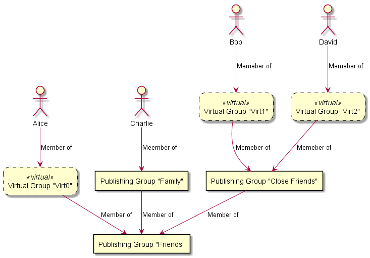
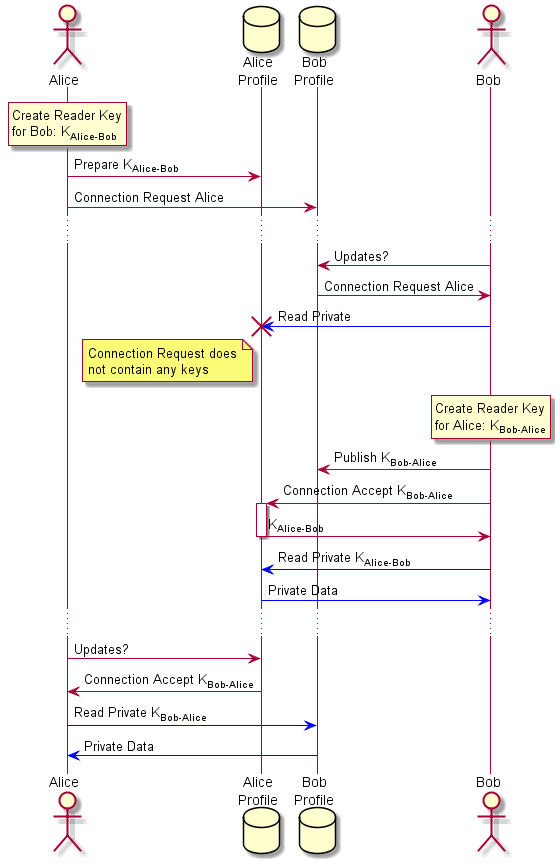

# Social Profile Exchange Protocol Specification
Version 0.3

## 1 Social profile

### 1.1 Cryptographic profile key pair
Every social profile is uniquely identified by an asymmetric cryptographic key pair. SPXP uses the
[Ed25519](http://ed25519.cr.yp.to/) signature algorithm for data authenticity and the corresponding public key as unique
identifier of a profile.  
Although this protocol allows profiles without a signing key, using one is highly recommended.

### 1.2 Profile URI
Every social profile is addressed by an _absolute URI_ as defined in [RFC 3986 Section 4.3](https://tools.ietf.org/html/rfc3986#section-4.3).
Every protocol client must support at least the scheme “https” and can choose to additionally support the scheme “http”
and others.

### 1.3 Unique profile identification
The cryptographic key takes precedence over the URI. Two profiles published under different URIs but using the same
cryptographic key must be considered identical. Data signed with different cryptographic keys delivered by the same URI
must be treated as different profiles.  
If a profile client detects a change in the signing key used by the profile behind a URI, it has to warn the user and
must not present the data signed by different keys as belonging to the same profile.  

### 1.4 Authenticating profiles
The profile key pair can only verify that all information published on this profile originates from the same entity
behind this profile, but it cannot validate it's identity.  
Authenticating the identity of a real life person or organisation behind a profile is achived by  a web of trust, where
profiles attest the identity of connected profiles.  
Alternatively, profiles can delegate their authentication to the domain name system (DNS). By publishing the public
profile key as TXT record in DNS, profiles can show that they are controlled by the same entity that has control over
the domain record in DNS.

## 2 Communication protocols
Data is exchanged between participating clients and servers via HTTP, preferably over TLS (i.e. HTTPS). Clients and
servers are encouraged to use the latest versions of these protocols, e.g. HTTP/2 and HTTP/3, and to prefer IPv6.

## 3 Transport encoding of structured data
Data is encoded as JSON according to [RFC 7519 “The JavaScript Object Notation (JSON) Data Interchange
Format”](https://tools.ietf.org/html/rfc7159). Please note that this standard defines the HTTP “Content-Type” header to
be “application/json” with no “charset” parameter. Clients must always use UTF-8 character encoding, irrespective of any
“charset” incorrectly sent by the server.  
The term ”Base64Url” throughout this specification refers to the URL safe Base 64 Encoding as apecified in [RFC 4648
Section 5](https://tools.ietf.org/html/rfc4648#section-5) without padding.

## 4 Protocol versioning
This protocol uses [Semantic Versioning](https://semver.org/). This document specifies protocol version is “0.3”.

## 5 Social profile root document
Protocol servers respond to requests for the social profile URI with the social profile root document. This JSON object
is composed of the following members:

| Name | Type | Mandatory | Description |
|---|---|---|---|
| ver | String | required | Version of the SPXProtocol exposed by this URI. <br/> This specification is defining version “0.3” |
| name | String | required | The display name of this profile |
| shortInfo | String | optional | Additional short description of this profile |
| about | String | optional | Additional long description of this profile, like a resume or bio |
| gender | String | optional | Free text string specifying the gender of this profile. Clients should recognize the english text strings “female” and “male” and display localized text or icons. All other content can be displayed as-is. |
| website | String | optional | URI of the profile’s website |
| email | String | optional | Email address of this profile |
| birthDayAndMonth | String | optional | String of the format “dd-mm” with “dd” being a numeric value 1-31 and “mm“ being a numeric value 1-12 specifying the day and month of birth of this profile in the Gregorian calendar |
| birthYear | String | optional | String containing a positive numeric integer specifying the year of birth of this profile in the Gregorian calendar |
| hometown | Object | optional | [Social profile reference](#7-profile-reference-object) of the profile's hometown |
| location | Object | optional | [Social profile reference](#7-profile-reference-object) of the profile's current location |
| coordinates | Object | optional | JSON Object containing two members “latitude” and “longitude” containing numeric values encoded as Strings specifying the profiles current position in signed degrees format in the WGS84 geodetic system. <br/> Latitude ranges from -90 to +90 and longitude ranges from -180 to +180. |
| profilePhoto | String <br/> or <br/> Object | optional | String containing a _URI-reference_ as defined in [RFC 3986 Section 4.1](https://tools.ietf.org/html/rfc3986#section-4.1) pointing to a resource holding a profile photo. Clients should at least support images in JPEG and PNG format. <br/> or <br/> JSON object holding decryption details and the location of an encrypted profile photo resource. (see [chapter 8](#8-encrypted-resources)) |
| friendsEndpoint | String | optional | _URI-reference_ as defined in [RFC 3986 Section 4.1](https://tools.ietf.org/html/rfc3986#section-4.1) pointing to the “friends endpoint” as specified in [chapter 10](#10-friends-endpoint) |
| postsEndpoint | String | optional | _URI-reference_ as defined in [RFC 3986 Section 4.1](https://tools.ietf.org/html/rfc3986#section-4.1) pointing to the “posts endpoint” as specified in [chapter 11](#11-posts-endpoint) |
| keysEndpoint | String | optional | _URI-reference_ as defined in [RFC 3986 Section 4.1](https://tools.ietf.org/html/rfc3986#section-4.1) pointing to the “keys endpoint” as specified in [chapter 13.2](#132-keys-endpoint) |
| publishEndpoint | String | optional | _URI-reference_ as defined in [RFC 3986 Section 4.1](https://tools.ietf.org/html/rfc3986#section-4.1) pointing to the “publish endpoint” as specified in [chapter 15](#15-publishing) |
| publicKey | Object | optional | [Profile public key object](#6-profile-public-key-object) describing the public key of the [profile key pair](#11-cryptographic-profile-key-pair) |
| connect | Object | optional | Additional details for the connection process, if and only if this object accepts connection requests as specified in [chapter 16](#16-profile-connections) |
| private | Array | optional | Array of private data as specified in [chapter 12](#12-private-data) |

Example:
```json
{
    "ver" : "0.3",
    "name" : "Crypto Alice",
    "shortInfo" : "I love cryptography.",
    "about" : "Alice and Bob are fictional characters commonly used as a placeholder name in cryptology, as well as science and engineering literature. The Alice and Bob characters were invented by Ron Rivest, Adi Shamir, and Leonard Adleman in their 1978 paper \",A Method for Obtaining Digital Signatures and Public-key Cryptosystems\".",
    "gender" : "female",
    "website" : "https://en.wikipedia.org/wiki/Alice_and_Bob",
    "email" : "cryptoalice@example.com",
    "birthDayAndMonth" : "04-04",
    "birthYear" : "1977",
    "hometown" : {
        "uri" : "https://example.com/spxp/emerald.city",
        "publicKey" : {
            "kid": "DJlPdI5nMAYjDevc",
            "kty" : "OKP",
            "crv" : "Ed25519",
            "x": "1B7B4OpoRBA6UvtewqF9cb_P1PiXVpc4f1THHfkzLmY"
        }
    },
    "location" : {
        "uri" : "https://hill-valley.example.com/profile",
        "publicKey" : {
            "src": "dns"
        }
    },
    "coordinates" : {
        "latitude" : "-42.1604",
        "longitude" : "-23.4637"
    },
    "profilePhoto" : " https://images.example.com/alice.jpg",
    "friendsEndpoint" : "friends/alice",
    "postsEndpoint" : "posts?profile=alice"
}
```

## 6 Profile public key object
The public key of a [profile key pair](#11-cryptographic-profile-key-pair) is described by a JSON object with the
following members:

| Name | Type | Mandatory | Description |
|---|---|---|---|
| src | String | optional | The source where to find the public key. Possible values are “embed” and “dns”. Defaults to “embed” if missing. |
| kid | String | required for “embed” | Unique random key ID |
| kty | String | required for “embed” | Key type. Always “OKP” |
| crv | String | required for “embed” | Curve for Elliptic Curve public keys. Always “Ed25519”. |
| x | String | required for “embed” | Base64Url encoded octet public key |

In the case of an embedded public key (`"src" : "embed"`), this object is identical to a JWK as  defined in [RFC 7517
“JSON Web Key (JWK)”](https://tools.ietf.org/html/rfc7517) using the Ed25519 curve specifier as defined in [RFC 8037
Section 3.1](https://tools.ietf.org/html/rfc8037#section-3.1). Must have a unique, random key id (“kid”).  

### 6.1 Domain bound profile key pair
It is possible to bind the identity of a profile to the DNS (see [1.4](#14-authenticating-profiles)). In this case,
the `src` member of the profile public key object is set to `dns`. Clients need to read the `TXT` record named
`spxp-public-profile-key` for the domain of the profile URI from DNS. This String value then contains a Base64Url
encoded JSON object describing the public key of the profile's key pair as JWK defined in [RFC 7517 “JSON Web Key
(JWK)”](https://tools.ietf.org/html/rfc7517) using the Ed25519 curve specifier as defined in [RFC 8037 Section
3.1](https://tools.ietf.org/html/rfc8037#section-3.1). It must have a unique, random key id (“kid”).

## 7 Profile reference object
Profiles are referenced by combining their [profile URI](#12-profile-uri) with the public key of their [profile key
pair](#11-cryptographic-profile-key-pair). This guarantees that the profile behind a URI is still controlled by the same
entity as it has been at the time of creating this reference. References to other profiles are described by a JSON
object with these members:

| Name | Type | Mandatory | Description |
|---|---|---|---|
| uri | String | required | [Profile URI](#12-profile-uri) of referenced profile |
| publicKey | Object | optional | [Profile public key object](#6-profile-public-key-object) describing the public key of the [profile key pair](#11-cryptographic-profile-key-pair) of the referenced profile |

Example:
```json
{
    "uri" : "https://example.com/spxp/alice",
    "publicKey" : {
        "kid" : "C8xSIBPKRTcXxFix",
        "kty" : "OKP",
        "crv" : "Ed25519",
        "x" : "skpRppgAopeYo9MWRdExl26rGA_z701tMoiuJ-jIjU8"
    }
}
```

## 8 Encrypted resources
External resources, like images and videos, can be encrypted with the decryption key being stored as a JSON object
describing the resource. Encryption is performed with 256 bit AES in Galois/Counter Mode. The object holding the
decryption information has these members:

| Name | Type | Mandatory | Description |
|---|---|---|---|
| iv | String | required | Base64Url encoded random initialisation vector (96 bit) |
| k | String | required | Base64Url encoded octet key (256 bit) |
| tag | String | required | Base64Url encoded message authenticity tag (128 bit) |
| uri | String | required | _URI-reference_ as defined in [RFC 3986 Section 4.1](https://tools.ietf.org/html/rfc3986#section-4.1) pointing to a resource containing the encrypted data |

This object format is inspired by JWE, but does not follow this standard.  
Example of a profile with an encrypted profile photo:
```json
{
    "name" : "Crypto Alice",
    "profilePhoto" : {
        "iv" : "7Y_F7cQWZA-PYoMn",
        "k" : "qgWVB5SupcdvHARM60knXv8h6tI2unD3GjhsPRKvT_I",
        "tag" : "lN19Pd0PrGmIWWp26NctcQ",
        "uri" : "images_enc/alice.encrypted"
    }
}
```

## 9 Data authenticity
JSON objects can be signed with a method that is designed after [JSON signatures in the matrix protocol
specification](https://matrix.org/docs/spec/appendices#signing-json), but which is specified slightly different. If a
profile exposes an Ed25519 public key as part of the profile root document, all information transmitted through SPXP has
to be signed with this key to be considered authentic. A protocol client must not present any information to the user in
the context of this profile that has not been signed by the announced profile key or its authorised delegates.

### 9.1 Signing JSON objects
To sign an object, the “private” and “seqts” member fields are removed, it is converted into [Canonical JSON](#911-canonical-json),
the optional aad is attached, it is converted to a byte stream using UTF-8 character encoding and then signed with the
profile key pair ([1.1](#11-cryptographic-profile-key-pair)) using the [Ed25519](http://ed25519.cr.yp.to/) signature
algorithm. The resulting signature is then embedded into the JSON object as `signature` object with the following members:

| Name | Type | Mandatory | Description |
|---|---|---|---|
| key | String <br/> or <br/> Object | required | Contains either the key id (“kid”) of the profile key pair ([1.1](#11-cryptographic-profile-key-pair)) as String or a certificate chain of an authorized signing key as defined in [chapter 9.2](#92-authorized-signing-keys) |
| aad | String | optional | additional authenticated data |
| sig | String | required | Base64Url encoded Ed25519 signature |

Example:
```json
{
    "ver" : "0.3",
    "name" : "Crypto Alice",
    "shortInfo" : "I love cryptography.",
    "website" : "https://en.wikipedia.org/wiki/Alice_and_Bob",
    "publicKey" : {
        "kid" : "C8xSIBPKRTcXxFix",
        "kty" : "OKP",
        "crv" : "Ed25519",
        "x" : "skpRppgAopeYo9MWRdExl26rGA_z701tMoiuJ-jIjU8"
    },
    "signature" : {
        "key" : "C8xSIBPKRTcXxFix",
        "sig" : "WnRIWY8eoU5qPzWlgYjaT_j5x1MnQKpS2vD-8sC2ScnqEldHcLDnIEwRz1fOkGklq1ojNB4D2tRJVbEBrFB3AA"
    }
}
```
If a JSON object solely consists of a `seqts`  and a `private` member, it does not need to be signed. Signing these
objects is even discouraged to save space and avoid a false feeling of authenticity.  
Additional Authenticated Data (AAD) can be included in the signature, which is used to prevent session replay attacks
when encrypted data is published.

#### 9.1.1 Canonical JSON
Canonical JSON is the shortest serialization with lexicographically sorted members in objects. This means in particular:
1. All insignificant whitespace outside of Strings is removed
2. Members in objects are lexicographically sorted based on their key by unicode codepoint
3. Escaping in strings is limited to and required for `\"`, `\\`, `\t`, `\b`, `\n`, `\r`, `\f` and all codepoints less than 32 encoded by `\u####` 

### 9.2 Authorized signing keys
A profile can authorize other keys to publish information on this profile. In this case, the profile issues a
certificate that combines the authorized public key with a grant, and then signs this object. This certificate is a JSON
object with the following members:

| Name | Type | Mandatory | Description |
|---|---|---|---|
| publicKey | Object | required | JSON object describing the public key of the profile's key pair as JWK defined in [RFC 7517 “JSON Web Key (JWK)”](https://tools.ietf.org/html/rfc7517) using the Ed25519 curve specifier as defined in [RFC 8037 Section 3.1](https://tools.ietf.org/html/rfc8037#section-3.1). <br/> Must have a unique, random key id (“kid”) |
| grant | Array | required | Array of Strings identifying the operations that this key pair is allowed to perform |

This certificate object must be signed as defined in [chapter 9.1](#91-signing-json-objects). Since the key of this
signature can be a certificate again, it is possible to chain multiple certificates. The end of this chain must be the
profile key pair ([1.1](#11-cryptographic-profile-key-pair)).  

Valid “grant” values are (case sensitive):

| Grant | Allows to sign |
|---|---|
| post | Individual post objects. If not combined with “impersonate”, then only in their own name. |
| friends | Data published on the friends endpoint |
| grant | Other certificates, if these do not grant permissions that exceed the permissions on this certificate, except the permissions “grant” and “ca” |
| ca | Other certificates, if these do not grant permissions that exceed the permissions on this certificate, including the permissions “grant” and “ca” |
| impersonate | Posts in the name of this profile |

The profile root document ([5](#5-social-profile-root-document)) must always be signed by the profile key pair
([1.1](#11-cryptographic-profile-key-pair)).

Example:
```json
{
    "publicKey" : {
        "kid" : "czlHMPEJcLb7jMUI",
        "kty" : "OKP",
        "crv" : "Ed25519",
        "x" : "vg42ogNHigJnwZ0pwwMzUtaXZA49eqcfGYl2u9GR8vg"
    },
    "grant" : [ "post" ],
    "signature" : {
        "key" : "C8xSIBPKRTcXxFix",
        "sig" : "PEekh7oCLQa0O4rCUPrH19yCJCLtEZfnumUlPrH0TPbq66Bj_aO71enf-P6gUttlgJFRRfvD1D7wAAYZaX6PCQ"
    }
}
```
Please note that certificates do not allow domain bound profile keys. You can use a DNS bound key to _sign_ a
certificate, but the key getting granted permissions must be part of the certificate itself.

### 9.3 Self-signed profile key
The profile root document ([5](#5-social-profile-root-document)) must be signed with the key listed as “publicKey” in
the same document. It thus constitutes a self-signed certificate.  
Profile clients have to “lock in” on this key and only present data to the user that has been signed by this key. It is
important to understand that this proves the authenticity of data against this profile, but it does not verify the
identity of the entity controlling this profile.

## 10 Friends endpoint
Social profiles can expose a list of other social profiles as “friends”. If the profile root object declares a
`friendsEndpoint`, then it exposes a JSON object as follows:

| Name | Type | Mandatory | Description |
|---|---|---|---|
| data | Array | required | Array of [Social profile reference objects](#7-profile-reference-object) |
| private | Array | optional | Array of private data as specified in [chapter 12](#12-private-data) |

Example:
```json
{
    "data" : [ {
        "uri" : "https://example.com/spxp/alice",
        "publicKey" : {
            "kid" : "C8xSIBPKRTcXxFix",
            "kty" : "OKP",
            "crv" : "Ed25519",
            "x" : "skpRppgAopeYo9MWRdExl26rGA_z701tMoiuJ-jIjU8"
        }
    }, {
        "uri" : "https://example.com/spxp/bob",
        "publicKey" : {
            "kid" : "czlHMPEJcLb7jMUI",
            "kty" : "OKP",
            "crv" : "Ed25519",
            "x" : "vg42ogNHigJnwZ0pwwMzUtaXZA49eqcfGYl2u9GR8vg"
        }
    } ]
}
```
	
## 11 Posts endpoint
Social profiles can publish a stream of timestamped messages, named “posts”. If a social profile declares a
`postsEndpoint` in the profile root document, then the server responds with the following JSON object:

| Name | Type | Mandatory | Description |
|---|---|---|---|
| data | Array | required | List of post objects |
| more | Boolean | required | True if and only if there are more posts before the oldest post in the “data” array |

Each single post in the data array is a JSON object with these members:

| Name | Type | Mandatory | Description |
|---|---|---|---|
| seqts | String | required | Sequence timestamp of post in the format “YYYY-MM-DD’T’hh:mm:ss.sss” always in UTC. Probably assigned by the SPXP server when it received this post object. <br/> The sequence timestamp must be unique across all posts of a profile. <br/> This member is not part of the signature. |
| createts | String | optional | Optional creation timestamp of post in the format “YYYY-MM-DD’T’hh:mm:ss.sss” always in UTC. Assigned by the client when this post got created. |
| author | String | optional | Profile URI of post author, if this post has been created by a different profile and then published on this profile. <br/> If set, the client has to resolve this profile root document and check the signature on this post against the profile key of the “author” profile. This key needs to bring a certificate on this post that grants “post” permission (7.2). |
| type | String | required | Type of post. One of “text”, “web”, “photo” or “video” |

Depending on the “type”, additional members are defined as follows:

#### Type “text”:
| Name | Type | Mandatory | Description |
|---|---|---|---|
| message | String | required | Text message |
| place | Object | optional | [Social profile reference](#7-profile-reference-object) of a place linked to the message |

#### Type “web”:
| Name | Type | Mandatory | Description |
|---|---|---|---|
| message | String | optional | Text message |
| link | String | required | URI of linked web page |

#### Type “photo”:
| Name | Type | Mandatory | Description |
|---|---|---|---|
| message | String | optional | Text message |
| small | String <br/> or <br/> Object | required | _Absolute URI_ as defined in [RFC 3986 Section 4.3](https://tools.ietf.org/html/rfc3986#section-4.3) pointing to a resource holding a preview image. Clients should at least support images in JPEG and PNG format. <br/> or <br/> JSON object holding decryption details and the location of an encrypted preview image resource. (see [chapter 8](#8-encrypted-resources)) |
| full | String <br/> or <br/> Object | optional | _Absolute URI_ as defined in [RFC 3986 Section 4.3](https://tools.ietf.org/html/rfc3986#section-4.3) pointing to a resource holding a high resolution image. Clients should at least support images in JPEG and PNG format. <br/> or <br/> JSON object holding decryption details and the location of an encrypted high resolution image resource. (see [chapter 8](#8-encrypted-resources)) |
| place | Object | optional | [Social profile reference](#7-profile-reference-object) of a place linked to the photo |

#### Type “video”:
| Name | Type | Mandatory | Description |
|---|---|---|---|
| message | String | optional | Text message |
| preview | String <br/> or <br/> Object | required | _Absolute URI_ as defined in [RFC 3986 Section 4.3](https://tools.ietf.org/html/rfc3986#section-4.3) pointing to a resource holding a preview image. Clients should at least support images in JPEG and PNG format. <br/> or <br/> JSON object holding decryption details and the location of an encrypted preview image resource. (see [chapter 8](#8-encrypted-resources)) |
| media | String <br/> or <br/> Object | required | _Absolute URI_ as defined in [RFC 3986 Section 4.3](https://tools.ietf.org/html/rfc3986#section-4.3) pointing to a resource holding a video media file. Clients should at least support MP4 containers with H.264 video and AAC audio codec. <br/> or <br/> JSON object holding decryption details and the location of an encrypted video media resource. (see [chapter 8](#8-encrypted-resources)) |
| place | Object | optional | [Social profile reference](#7-profile-reference-object) of a place linked to the photo |

Example:
```json
{
    "data" : [
        {
            "seqts" : "2018-09-17T14:04:27.373",
            "createts" : "2018-09-16T12:23:18.751",
            "type" : "text",
            "message" : "Hello, world!",
            "signature" : {
                "key" : "C8xSIBPKRTcXxFix",
                "sig" : "bDOgcT4uxTKYMTuOJXDbAPc1UA2p-aGdxwplUWNStzyDRIRPu9UxaTU1IoZ1ELjBY5iRf4FEBPV09Uw9TOYuCA"
            }
        }, {
            "seqts" : "2018-09-15T12:35:47.735",
            "type" : "web",
            "message" : "Interesting read...",
            "link" : "https://example.com",
            "signature" : {
                "key" : "C8xSIBPKRTcXxFix",
                "sig" : "skQBzttDURV-N4kqK9fgyWw4Ddixsmld4nnilC_XUqSZhXfeNfw_4PrIlLwaFdHDTO-au4iaZM64oSWLP-z0BA"
            }
        }, {
            "seqts" : "2018-09-16T13:35:47.735",
            "createts" : "2018-09-16T12:25:13.614",
            "author" : "https://example.com/ctypto.bob",
            "type" : "photo",
            "message" : "Look at this",
            "full" : "https://example.com/full-image.jpeg",
            "small" : " https://example.com/small-image.jpeg",
            "signature" : {
                "key" : {
                    "publicKey" : {
                        "kid" : "czlHMPEJcLb7jMUI",
                        "kty" : "OKP",
                        "crv" : "Ed25519",
                        "x" : "vg42ogNHigJnwZ0pwwMzUtaXZA49eqcfGYl2u9GR8vg"
                    },
                    "grant" : [ "post" ],
                    "signature" : {
                        "key" : "C8xSIBPKRTcXxFix",
                        "sig" : "PEekh7oCLQa0O4rCUPrH19yCJCLtEZfnumUlPrH0TPbq66Bj_aO71enf-P6gUttlgJFRRfvD1D7wAAYZaX6PCQ"
                    }
                },
                "sig" : "94dyGxvPcVuueFjVj_RwedWy5m3dasRDYf1iOxnYXUEYDS33LYzn9kqe6aIRMZchxWqlM1K_fX-uHVFDRjzSAg"
            }
        }
    ],
    "more" : true
}
```

### 11.1 Signing and Encrypting Posts
Posts can be requested individually from the server. Thus, post messages are signed individually and independent of
each other. Also private data is embedded in each post individually instead of the server response as whole.  
The member `seqts` is not part of the signature. It is a technical field assigned by the server. To authenticate a
specific creation time, the `createts` member should be used.

### 11.2 Requesting Posts from the Server
The `data` array contains a subset of posts known by the server. The number of returned items is chosen by the SPXP
server, but the client can attach a `max` query parameter to influence this number. The client can further attach
`before` and `after` query parameters to specify a date range of requested items. The server guarantees that there are
no additional items available between the oldest and the youngest items returned in the data array. The `more` member in
the response indicates if there are additional items available between the oldest item in the `data` array and the
requested date range.  
Supported query parameters:

| Name | Type | Description |
|---|---|---|
| max | Integer | Maximum number of items the client can handle in one response. The server can return fewer items than that, but must not return more items. |
| before | timestamp | Only include items with a timestamp before this date |
| after | timestamp | Only include items with a timestamp after this date |

Example:  
Let’s assume the posts endpoint is specified in the profile root document as  
```
https://spxp.example.com/posts?user=alice
```
The client runs this initial query
```
https://spxp.example.com/posts?user=alice&max=2
```
The server returns two post items
```json
{
    "data" : [
        {
            "seqts" : "2018-09-17T14:04:27.373", "type" : "..."
        }, {
            "seqts" : "2018-09-15T12:35:47.735", "type" : "..."
        }
    ],
    "more" : true
}
```
Since the server indicated that there are more posts available before the oldest item in the data array, the client runs
another query
```
https://spxp.example.com/posts?user=alice&max=2&before=2018-09-15T12:35:47.735
```
The server then returns another two items
```json
{
    "data" : [
        {
            "seqts" : "2018-09-13T10:06:17.484", "type" : "..."
        }, {
            "seqts" : "2018-09-12T15:16:17.484", "type" : "..."
        }
    ],
    "more" : true
}
```
The client could continue this until it reaches the oldest post stored on the server. But ideally, it only loads a
limited window of all available posts and continues to load items when the user has reached the last known posts, e.g.
in an infinite scroll view.  
After some time, the client checks if new posts have been published
```
https://spxp.example.com/posts?user=alice&max=2&after=2018-09-17T14:04:27.373
```
The server returns these items
```json
{
    "data" : [
        {
            "seqts" : "2018-09-20T16:05:28.373", "type" : "..."
        }, {
            "seqts" : "2018-09-19T15:45:37.735", "type" : "..."
        }
    ],
    "more" : true
}
```
The more parameter indicates that there are more items available between the oldest item in the data array and the
`after` query parameter. So the client tries to close this gap:
```
https://spxp.example.com/posts?user=alice&max=2&after=2018-09-17T14:04:27.373&before=2018-09-19T15:45:37.735
```
And the server responds with
```json
{
    "data" : [
        {
            "seqts" : "2018-09-18T09:06:17.484", "type" : "..."
        }
    ],
    "more" : false
}
```

## 12 Private data
Specific JSON objects in the SPXP standard, as listed below, can contain encrypted data according to [RFC 7516 “JSON
Web Encryption (JWE)”](https://tools.ietf.org/html/rfc7516). These objects comprise an additional member named “private”
containing an array of either a String containing a JWE object in Compact Serialization or an object containing a JWE
object in JSON Serialization. The decrypted plaintext contains again a JSON object in UTF-8 charset encoding. The
decrypted objects are then merged into the main object according to the object merging rules defined in
[12.3](#123-object-merging-rules). If multiple JWE objects in the “private” array can be decrypted by the SPXP client,
then the contained objects are merged into the containing document in the order they appear in the “private” array.

### 12.1 Private data support
Private data is supported for:
- The social profile root document
- The friend endpoint object
- Individual post items. In this case, the “seqts” member must not be part of the encrypted data.

### 12.2 Supported algorithm and encoding
The only supported encryption method is direct encryption with 256 bit AES in Galois/Counter Mode, identified as
`"alg": "dir", "enc": "A265GCM"` by JWE. This requires a new random initialisation vector “iv” for each private block.

### 12.3 Object merging rules
A source object `src` is merged into a target object `dst` as follows:  
For each member in the source object `src.m` do:
- If `src.m` is an array and the target object contains an array with the same name, append the elements of `src.m` to
the elements in the target object `dst.m`.
- If `src.m` is an object and the target object contains an object with the same name, apply these merging rules to the
nested objects (i.e. merge `src.m` into `dst.m`).
- Otherwise, set the member `src.m` in the target object (i.e. `dst.m` := `src.m`).

### 12.4 Private data and signatures
The “private” array is removed from JSON objects before signing (see also [9.1](#91-signing-json-objects)). Instead, the
plaintext within each encrypted block must be signed individually. This prevents protocol servers from learning anything
about the author of an encrypted data block.  
If the JWE encrypted object uses Additional Authenticated Data (AAD), clients must validate that the AAD on the
encrypted JWE object matches the AAD in the signature of the decrypted plaintext. This feature is used to prevent replay
attacks on the publishing endpoint.

### 12.5 Full example of private data in profile root document
Example:
```json
{
    "ver" : "0.3",
    "name" : "Crypto Alice",
    "private" : [
        "eyJraWQiOiJBQkNELjEyMzQiLCJlbmMiOiJBMjU2R0NNIiwiYWxnIjoiZGlyIn0..SfT0skkIjzru5ylj.eDnedk0RIWIk6m6YQwwwzeZg7q1GH87HW5wUqKJcWRCNZHgI5hCUmDATDzW_eeUsQp8mkkQ4fpqlrBmX5lwv3vsdmgL4r-18GVhxGhbq6GxtbR8YE2MPTxJUZ3D56QHld8ZkOV5pOu7h5BhO9f2zKNEB2j0xbNEqgr259_T983VEoqqp0Rrze1qgmshMQLkZsUrbHsnDaPsp28bhRb_zMInvhBNfa6M.zYtiVMmo-TC_BhJDGPwoHA"
    ],
    "profilePhoto" : " https://images.example.com/alice.jpg",
    "friendsEndpoint" : "friends/alice",
    "postsEndpoint" : "posts/alice",
    "publicKey" : {
        "kid" : "C8xSIBPKRTcXxFix",
        "kty" : "OKP",
        "crv" : "Ed25519",
        "x" : "skpRppgAopeYo9MWRdExl26rGA_z701tMoiuJ-jIjU8"
    },
    "signature" : {
        "key" : "C8xSIBPKRTcXxFix",
        "sig" : "kS-ByECFG-QWN4M5XNpAkCsvpbpX7KU_JrOzLrPHFdoP1YBaP4TKqa-tAz4yqr3BWqMky0SN_fJcMv2VTAE_Aw"
    }
}
```
The `private` array contains one element in JWE Compact Serialization. The string is made up of 5 parts, encoded as
Base64Url and separated by dots.
The first part is
```
    eyJraWQiOiJBQkNELjEyMzQiLCJlbmMiOiJBMjU2R0NNIiwiYWxnIjoiZGlyIn0
```
It is Base64Url decoded to the JWE header:
```json
    {"kid":"ABCD.1234","enc":"A256GCM","alg":"dir"}
```
It specifies direct encryption with 256 bit AES in Galois/Counter Mode using the key “ABCD.1234”. Since we do not use a
separate content encryption key (`"alg":"dir"`), the second part is empty. The third part `SfT0skkI…` contains the
Initialization Vector and the forth part `eDnedk0R…` the ciphertext. The last part `zYtiVMmo…` contains the tag to
validate the message integrity. The ciphertext is then decrypted to
```json
    {"website":"https://example.com","signature":{"key":"C8xSIBPKRTcXxFix","sig":"nEd-NXLlBDjcmCJHhzn9CaVYuRBsG4SDDgdHql85xdGtgb_bql2SnZh2oeMf-dk_g-YhT3uRyZHZRTriUEnCBA"}}
```
The signature is validated with the same rules that apply to the object that conatins this private data and the object
then gets merged into the profile root document:
```json
{
    "ver" : "0.3",
    "name" : "Crypto Alice",
    "profilePhoto" : " https://images.example.com/alice.jpg",
    "friendsEndpoint" : "friends/alice",
    "postsEndpoint" : "posts/alice",
    "publicKey" : {
        "kty" : "OKP",
        "crv" : "Ed25519",
        "kid" : "ZUpNLu0Dc7u2ENdmKX",
        "x" : "11qYAYKxCrfVS_7TyWQHOg7hcvPapiMlrwIaaPcHURo"
    },
    "website" : "https://example.com"
}
```

## 13 Key management
Private data can only be decrypted by readers who are able to obtain the necessary decryption key. Due to the possibly
large number of readers and/or large number of data items, we cannot simply encrypt every single data element for all
possible readers. Instead, readers are organized in a hierarchical structure of groups. Decryption keys are then
encrypted themselves along a path through this hierarchy (key wrapping). The “keys endpoint” ([13.2](#132-keys-endpoint))
allows clients to discover groups relevant to them and to obtain keys required to decrypt dependant keys and data
elements.

### 13.1 Key Groups
Readers are organised in _groups_. Groups that are used to control the visibility of data are referred to as _publishing
groups_; while groups that are only generated by the client internally to better organize readers are referred to as
_virtual groups_. Logically, there is no difference between both, other than that publishing groups are available to the
end user when defining the audience of a new item (such as a post).  
Groups can have individual readers or other groups as members. A client could for example maintain the following
hierarchy of groups and readers:



Each group is uniquely identified by a _group id_. This id should be generated randomly. A stream of _round keys_ is
associated with each group. The key id of these round keys is generated by concatenating the group id with a dot and a
random round id. In the example above, the publishing group “Friends” could have the following stream of keys:
```
    grp-friends.key0, grp-friends.key1, grp-friends.key2, ...
```
The group id and the round id must only use characters used by the Base64Url encoding.  
If a group or reader is a member of another group, then it can decrypt the key stream of that group with its own key(s).
In the example above, the social profile could maintain the following keys:

| Key id | Can be decrypted with |
|---|---|
| grp-friends.key0 | grp-closefriends.key0, grp-virt0.key0, grp-family.key0 |
| grp-friends.key1 | grp-closefriends.key1, grp-virt0.key1, grp-family.key0 |
| grp-friends.key2 | grp-closefriends.key1, grp-virt0.key2, grp-family.key1 |
| grp-closefriends.key0 | grp-virt1.key0, grp-virt2.key1 |
| grp-closefriends.key1 | grp-virt1.key0, grp-virt2.key2 |
| grp-virt1.key0 | key-bob |
| grp-virt2.key1 | key-david |
| grp-virt2.key2 | key-david |
| grp-family.key0 | key-charlie |
| grp-family.key1 | key-charlie |
| grp-virt0.key0 | key-alice |
| grp-virt0.key1 | key-alice |
| grp-virt0.key2 | key-alice |

When a new post is created, the client of this profile would offer the groups “Friends”, “Close Friends” and “Family” as
possible audience. If the user selects “Friends” as audience, the client would pick the most recent key of this group,
“grp-friends.key2” in this example, and use it to encrypt the private data of this post.  
When Alice finds this post with the associated private data, she looks at the JWE header of the private data and learns
the required key id “grp-friends.key2”. If she does not have this key yet, she uses the keys endpoint to obtain the
encrypted keys “grp-friends.key2” and “grp-virt0.key2”, decrypts the key “grp-virt0.key2” with her private key
“key-alice”, uses this unwrapped key to further decrypt the key “grp-friends.key2” and finally uses this unwrapped key
to decrypt the private data.

### 13.2 Keys endpoint
If a social profile makes use of private data as defined in [chapter 12](#12-private-data), it has to announce a
`keysEndpoint` in the profile root document ([5](#5-social-profile-root-document)).  
This endpoint takes two request parameters:

| Name | Type | Description |
|---|---|---|
| reader | String | Mandatory comma separated list of reader key ids |
| request | String | Optional comma separated list of round key ids that the caller wants to decrypt |

The server responds with a 3 level JSON object. The names used for the members in each level are:  

| Level | Content |
|---|---|
| Outermost level | Group id or reader key id required to decrypt the keys given in this object |
| Middle level | Group id that can be decrypted |
| Inner level | Round id |

For example, if “key-alice” can decrypt round keys of the two groups “groupA” and “groupB”, then the response will look
like this:
```json
{
    "key-alice" : {
        "groupA" : {
            "key0" : "...",
            "key1" : "...",
            "key2" : "..."
        },
        "groupB" : {
            "key0" : "...",
            "key1" : "...",
            "key2" : "..."
        }
    }
}
```
If “groupA” is a member of “groupX”, so that round keys of “groupA” can decrypt round keys of “groupX”, the response
could look like this:
```json
{
    "key-alice" : {
        "groupA" : {
            "key0" : "...",
            "key1" : "...",
            "key2" : "..."
        },
        "groupB" : {
            "key0" : "..."
        }
    },
    "groupA" : {
        "groupX" : {
            "key0" : "...",
            "key1" : "...",
            "key2" : "..."
        }
    }
}
```
The innermost member contains a JWE object in compact serialization that contains the wrapped round key as JWK object.
The JWE headers of the ”groupX.key#” entries would define one of the ”groupA.key#” keys as the valid decryption key.  
If the `request` parameter is given, the server returns all round keys given in this list as well as all intermediate
round keys required to decrypt these keys until the initial key given as `reader`.  
Example:
```
GET https://example.com/spxp/roger/keys?connectionId=key-alice&request=groupX.key2
200 OK
{
    "key-alice" : {
        "groupA" : {
            "key1" : "..."
        }
    }
    "groupA" : {
        "groupX" : {
            "key2" : "..."
        }
    }
}
```
In this example, the round key ”groupX.key2” is encrypted with the round key ”groupA.key1”. The key id required to
decrypt the JWE object is given in the JWE header.  
If the `request` parameter is missing, the server can chose the set of round keys it returns. This set has to
include at least all round keys that are required to read all private data in the profile root document accessible to
the key given in the `reader`. It additionally should include enough round keys to decrypt a sensible amount of most
recent posts.

### 13.3 Supported algorithm and encoding
Key wrapping is limited to the same cryptographic algorithm and encoding as defined in [chapter
12.2](#122-supported-algorithm-and-encoding) for private data.

### 13.4 Reader keys
Reader keys can be distributed by any side channel among the audience and their key id can then be used on the keys
endpoint. There is also no requirement that readers have to maintain a profile themselves.  
A profile could for example distribute keys as part of a paid-for subscription outside of SPXP and then publish selected
information with SPXP only to paying subscribers.  
If another profile gets access to information published by this profile as part of a connection as defined in [chapter
16](#16-profile-connections), then the reader key is exchanged as part of the connection process.

## 14 Restrain encrypted data
Although private data is encrypted, it is good practice to limit access in order to protect against a key loss. In
the context of this protocol, it also prevents unauthorised readers from discovering the existence of data beyond their
access level.  
All SPXP endpoints support the additional query parameter `reader`, which takes a comma separated list of reader key
ids. SPXP servers should filter out all elements of any `private` array that cannot be decrypted by one of the given
reader keys. Since the SPXP server knows the key graph (see [chapter 13.1](#131-key-groups)), it is able to check if
there is a path from one of the given reader keys to one of the keys required to decrypt the private data.  
It is important to understand that this access restriction does not constitute an authentication mechanism. The server
just checks if the client knows the key id. But there is no test whatsoever performed by the server to check if the
client actually has this key.

## 15 Publishing
The information exposed through SPXP can originate from any backend, like a content management system. If a profile
accepts new information published directly from social profile clients, either from the profile owner or any other
authorized source, it declares a `publishEndpoint` in the profile root document.

### 15.1 Publish endpoint
To publish a piece of information, like a post, the protocol client sends an HTTP POST request to the “publish endpoint“
with a JSON object as HTTP body. Thus object is composed of the following members:

| Name | Type | Mandatory | Description |
|---|---|---|---|
| type | String | required | Type of information to be published. In this version of the protocol, only “post” is supported. |
| ver | String | required | Most recent version of the SPXProtocol supported by the client |
| payload | Object | required | The object to be published |
| authToken | String | required | One time authentication token as specified in [chapter 15.2](#152-authentication-tokens) |

The server responds with one of these status codes.

| Status code | Meaning |
|---|---|
| 204 | The information has been accepted and stored |
| 403 | The authentication token is not present or invalid |
| 429 | The client IP address has sent too many requests to the profile server in a given time window |

Example:
```json
{
    "type" : "post",
    "ver" : "0.3",
    "payload" : {
        "createts" : "2018-09-16T12:23:18.751",
        "type" : "text",
        "message" : "Hello, world!",
        "signature" : {
            "key" : "C8xSIBPKRTcXxFix",
            "aad" : "a0b1c2d3e4f5g6h7i8j9",
            "sig" : XXXX
        }
    },
    "authToken" : "a0b1c2d3e4f5g6h7i8j9"
}
```

To prevent session replay attacks, the authentication token needs to be embedded in the actual signature as additional
authenticated data. On unencrypted payloads, the server needs to verify that the `authToken` value is part of the
signature and that this signature is valid. On encrypted payloads, the server needs to verify that the `authToken` is
set as `aad` on the JWE object. Clients with the appropriate reader key then need to verify that the authentication
tag on the JWE object is valid and that this `aad` is included in the signature within the encrypted object.

### 15.2 Authentication tokens
When a public, unencrypted payload is sent to the publishing endpoint, the server obviously knows about the content and
the author. Just like anybody else. But when an encrypted payload is sent to the server, it should not be able to learn
anything about the plaintext content, its author or any other metadata.  
This makes authenticating requests to the publishing endpoint and preventing session replay attacks challenging.

#### 15.2.1 Acquiring an Authentication Token
**TO BE DEFINED - Work in progress**

#### 15.2.2 Preventing Session Replay
Since the server does not know anything about the content of the encrypted payload, the publishing endpoint is
vulnerable to session replay attacks. An actor with publishing permissions could simply take any existing post, encrypt
it again, acquire a fresh authentication token, and then send it to the publishing endpoint. The server will always accept
it as long as the authentication token is valid.  
By enforcing that the authentication token must be embedded as AAD in the JWE object, we can bind the encrypted object
to this individual publishing request in a way that can be checked by the server without exposing details about the
encrypted data. The individual clients then need to validate the AAD on the JWE against the signature in the decrypted
plaintext.

## 16 Profile Connections
Two profiles can be mutually connected. This gives the entities behind each profile extended access to data published by
the connected peer profile, and optionally mutual publishing permissions.  
The entire connection process uses end to end encryption between the clients of both profiles, so that no intermediate
actor can learn anything about new or existing connections.  
The clients exchange messages via the profile servers, which act as relay agents without being able to see the message
content. This creates some extra challenges to prevent malicious use of this functionality.  
A profile can choose whether it wants to participate in connections or not. If a profile chooses to accept connection
requests from other profiles, it publishes a `connect` object as part of the profile root document. This object
contains the information required by other profiles to craft a connection request message and send it to the profile
server.

### 16.1 Connection Process
The connection process between two profiles controlled by “Alice” and “Bob” is as follows:
1. Alice creates a new [reader key](#134-reader-keys) and optionally an [authorized signing key](#92-authorized-signing-keys)
   for Bob as well as a random _connection establishment ID_ and an _ephemeral connection establishment key_.
2. Alice creates a connection package for Bob containing this reader key and certificate. She then encrypts this package
   with the _ephemeral connection establishment key_
2. Alice prepares her profile server to establish the connection on her behalf and deposits the connection package for
   Bob on her own profile server.
3. Alice creates a connection request message, encrypts it with Bob's public connection key and sends it to Bob's
   profile server. This message contains the _connection establishment ID_ and an _ephemeral connection establishment
   key_.
4. Next time when Bob checks his own profile server for **control messages**, he receives this encrypted connection request
5. Bob decrypts the connection request with his private connection key and decides weather he wants to accept this
   request or not. If Bob does not want to accept the request, this process ends here. **The connection request will time
   out on Alice's profile server.**
6. If Bob decides to accept, he creates a new [reader key](#134-reader-keys) and optionally an [authorized signing
   key](#92-authorized-signing-keys) for Alice, packs both in a connection package and encrypts this package with the
   _ephemeral connection establishment key_ from the connection request
7. Bob sends the encrypted package to Alice's profile server and receives the package Alice has deposited there for Bob
   in return
8. Bob decrypts the reader key and certificate from the package with the _ephemeral connection establishment key_ from
   the connection request
9. Next time when Alice checks her own profile server for **control messages**, she receives the encrypted package from
   Bob and decrypts the reader key and certificate from the package with the _ephemeral connection establishment key_

Note:  
It is important to understand that this process does not guarantee any kind of "quid pro quo" between both profiles. The
exchange of the encrypted packages in step 7 happens on a profile server, which is intentionally not able to check the
content of each package.  
Even if the server could guarantee the exchange of valid reader keys and certificates, it still does not guarantee that
both profiles grant each other similar permissions.  
It is an explicit design decision of this protocol that each profile has full control over the amount of information it wants to
expose. So a profile could issue a reader key in this process that does not give any substantial additional access over
what is publicly available anyway. The receiving profile has no chance to detect this situation since even the fact that
there is more information available beyond an actor's access level is hidden.



### 16.2 Connect object in profile root
If a profile accepts connection requests, it provides a `connect` object as part of the profile root document with the
following members:

| Name | Type | Mandatory | Description |
|---|---|---|---|
| endpoint | String | required | _URI-reference_ as defined in [RFC 3986 Section 4.1](https://tools.ietf.org/html/rfc3986#section-4.1) pointing to the “connect endpoint” as specified in [chapter 16.6](#166-connect-endpoint) |
| key | Object | required | JSON object describing the public key of the connection key pair as JWK defined in [RFC 7517 “JSON Web Key (JWK)”](https://tools.ietf.org/html/rfc7517) using the X25519 key agreement curve specifier as defined in [RFC 8037 Section 3.2](https://tools.ietf.org/html/rfc8037#section-3.2). |
| acceptedTokens | Array | optional | Array of Objects defining token acquisition methods accepted by this profile. See [chapter 16.5](#165-token-acquisition) |

Example:
```json
{
    "ver" : "0.3",
    "name" : "Crypto Alice",
    "shortInfo" : "I love cryptography.",
    "publicKey" : {
        "kid" : "C8xSIBPKRTcXxFix",
        "kty" : "OKP",
        "crv" : "Ed25519",
        "x" : "skpRppgAopeYo9MWRdExl26rGA_z701tMoiuJ-jIjU8"
    },
    "connect" : {
        "endpoint" : "connect/alice",
        "key" : {
            "kid" : "L-wsKFPrhxC7aau_",
            "kty" : "OKP",
            "crv" : "X25519",
            "x" : "ixVNCGQUR8gS6bkBDwh9IR4S_YAgkdwGNfJrqtsbTBU"
        },
        "acceptedTokens" : [ {
            "method" : "spxp.org:webflow:1.0",
            "start" : "https://profiles.example.com/acquire-token"
        } ]
    },
    "signature" : {
        ...
    }
}
```

### 16.3 Connection Package
Cryptographic material is transferred between protocol clients in _connection packages_. These are JSON objects with the
following members:

| Name | Type | Mandatory | Description |
|---|---|---|---|
| type | String | required | Fixed text string `connection_package` |
| ver | String | required | Most recent version of the SPXProtocol supported by the client |
| establishId | String | required | Unique random connection establishment ID |
| readerKey | Object | optional | JSON object describing a [reader key](#134-reader-keys) as JWK as defined in [RFC 7517 “JSON Web Key (JWK)”](https://tools.ietf.org/html/rfc7517) |
| publishingCertificate | Object | optional | JSON object describing the certificate containing the [authorized signing key](#92-authorized-signing-keys) |

Example:
```json
{
    "type" : "connection_package",
    "ver" : "0.3",
    "establishId" : "K4dwfD4wA67xaD-t",
    "readerKey" : {
        "kid" : "ABCD.1234",
        "kty" : "oct",
        "alg" : "A256GCM",
        "k" : "Dl3fyz_0lHaSeFl-TJxSTr2NET5H6t2SELmI5tiCFno"
    },
    "publishingCertificate" : {
        "publicKey" : {
            "kid" : "czlHMPEJcLb7jMUI",
            "kty" : "OKP",
            "crv" : "Ed25519",
            "x" : "vg42ogNHigJnwZ0pwwMzUtaXZA49eqcfGYl2u9GR8vg"
        },
        "grant" : [ "post" ],
        "signature" : {
            "key" : "C8xSIBPKRTcXxFix",
            "sig" : "PEekh7oCLQa0O4rCUPrH19yCJCLtEZfnumUlPrH0TPbq66Bj_aO71enf-P6gUttlgJFRRfvD1D7wAAYZaX6PCQ"
        }
    },
    "signature" : {
        XXXXX
    }
}
```

The connection package must be signed by the issuer. It is then encrypted according to [RFC 7516 “JSON Web Encryption
(JWE)”](https://tools.ietf.org/html/rfc7516) using the _ephemeral connection establishment key_. The only supported
encryption method is direct encryption with 256 bit AES in Galois/Counter Mode, identified as `"alg": "dir", "enc":
"A265GCM"` by JWE. This requires a new random initialisation vector “iv” for each package.

### 16.4 Preparing a Connection
The initiator prepares the connection by sending the reader key and encrypted connection package to her or his own
profile server using the *profile management endpoint*. This data is associated with the _connection establishment ID_.
The server knows how this reader key fits into the key graph, but does not know anything about the peer profile this
connection is prepared for.

### 16.4 Connect Message
To initiate a connection, the client generates a JSON object with the following members:

| Name | Type | Mandatory | Description |
|---|---|---|---|
| type | String | required | Fixed text string `connection_request` |
| ver | String | required | Most recent version of the SPXProtocol supported by the client |
| timestamp | String | required | Timestamp when the client created this request in the format “YYYY-MM-DD’T’hh:mm:ss.sss” always in UTC |
| expires | String | required | Timestamp until when the server of the profile initiating this request will accept a key exchange in the format “YYYY-MM-DD’T’hh:mm:ss.sss” always in UTC |
| establishId | String | required | Unique random connection establishment ID |
| requester | Object | required | [Social profile reference](#7-profile-reference-object) of the profile sending the connection request |
| requestee | Object | required | [Social profile reference](#7-profile-reference-object) of the profile this request is sent to |
| responseEndpoint | String | optional | _URI-reference_ as defined in [RFC 3986 Section 4.1](https://tools.ietf.org/html/rfc3986#section-4.1) relative to the requester profile URI specifying the endpoint to be used by the requestee to [exchange connection packages](#167-connection-package-exchange). If missing, the requesters connection endpoint is used. |
| offering | Array | required | Array of Strings identifying the access that the requester is offering with this connection |
| establishKey | Object | required | JSON object describing the ephemeral connection establishment key pair as JWK defined in [RFC 7517 “JSON Web Key (JWK)”](https://tools.ietf.org/html/rfc7517) |

Valid “offering” values are (case sensitive):

| Offering | Providing |
|---|---|
| read | When accepting this request, the requestee is given a [reader key](#134-reader-keys) with extended access to the requesters data |
| publish | When accepting this request, the requestee is given a [signing key](#92-authorized-signing-keys) allowing to publish posts on this profile (only in its own name) |

Example:
```json
{
    "type" : "connection_request",
    "ver" : "0.3",
    "timestamp" : "2020-01-12T09:40:17.734",
    "expires" : "2020-07-12T09:40:17.734",
    "establishId" : "K4dwfD4wA67xaD-t",
    "requester" : {
        "uri" : "https://example.com/spxp/alice",
        "publicKey" : {
            "kid" : "C8xSIBPKRTcXxFix",
            "kty" : "OKP",
            "crv" : "Ed25519",
            "x" : "skpRppgAopeYo9MWRdExl26rGA_z701tMoiuJ-jIjU8"
        }
    },
    "requestee" : {
        "uri" : "https://example.com/spxp/bob",
        "publicKey" : {
            "kid" : "czlHMPEJcLb7jMUI",
            "kty" : "OKP",
            "crv" : "Ed25519",
            "x" : "vg42ogNHigJnwZ0pwwMzUtaXZA49eqcfGYl2u9GR8vg"
        }
    },
    "offering" : [
        "read",
        "publish"
    ],
    "establishKey" : {
        "kid": "T7n_19BqWjU17l1s",
        "kty": "oct",
        "alg": "A256GCM",
        "k": "AnkrwD_Et1E0-FB0XYU38hpmdEGr0LOBO8O2HRdzgOw"
    },
    "signature" : {
        XXXXX
    }
}
```

The connection request object must always be signed by the requester. It is then encrypted according to [RFC 7516 “JSON
Web Encryption (JWE)”](https://tools.ietf.org/html/rfc7516) using the Elliptic Curve Diffie-Hellman Ephemeral Static key
agreement on the X25519 curve and content encrypted with 256 bit AES in Galois/Counter Mode, identified by
JWE as `"alg": "ECDH-ES", "enc": "A265GCM"`.

### 16.5 Token acquisition
Since the content of the connection request message is not accessible by the profile server, this process can easily be
misused by malicious actors automatically sending connection requests.  
To prevent this, profiles can request a unique token to be present on connection requests. An extensible framework
defines how clients who wish to connect can obtain such a token, for instance by walking the user through a captcha
process in the browser. This token is available on the unencrypted portion of the message, so that the task of
gatekeeping can be delegated to the profile server without exposing the actual connection process.  
If the `connect` object in the profile root document contains an array member named `acceptedTokens`, which has at least
one element, then the profile indicates that it requires a token to be present on each connection request.  
Each member of this array describes a possible method to obtain such a token. The client can freely pick one of them it
supports.  
Every object in the `acceptedTokens` array must have at least this member:

| Name | Type | Mandatory | Description |
|---|---|---|---|
| method | String | required | Text string identifying the token acquestion method described by this object |

Implementors are encouraged to use a maven GAV like naming pattern.

This protocol specification defines the "Web Flow" token acquisition method in [Appendix A. Web Flow token acquisition
method](#appendix-a-web-flow-token-acquisition-method) and leaves it to implementors to define additional methods.

### 16.6 Connect endpoint
The encrypted [connect message](#164-connect-message) is is sent to the “connect endpoint“ with a HTTP POST request,
optionally combined with a connect token. The requesting client sends a JSON object with the following members as HTTP
body:

| Name | Type | Mandatory | Description |
|---|---|---|---|
| type | String | required | Fixed text string `connection_request` |
| ver | String | required | Most recent version of the SPXProtocol supported by the client |
| msg | Object | required | JWE object in JSON Serialization containing the encrypted connection request message |
| token | Object | optional | JSON Object containing two String members “method” and “value” containing token acquestion method chosen by the client and the token value |

The server responds with one of these status codes

| Status code | Meaning |
|---|---|
| 204 | The connection request has been accepted and stored |
| 403 | The token is not present or invalid |
| 429 | The client IP address has sent too many connection requests to the profile server in a given time window or this profile has too many connection requests already waiting to be processed |

Example:
```json
{
    "type" : "connection_request",
    "ver" : "0.3",
    "msg" : {
        "protected" : "eyJlbmMiOiJBMjU2R0NNIn0",
        "unprotected" : {
            "alg" : "ECDH-ES"
        },
        "recipients" : [ {
            "header" : {
                "kid" : "L-wsKFPrhxC7aau_",
                "epk" : {
                    XXXX
                }
            }
        } ],
        "iv" : "PbxwX5e5Dv2E5_2_",
        "ciphertext" : "sbFRyJKu0PHPDBnRpE69wz0SXS_Tc4nb9u0ARlp6PsmWUSgArBlJDZ45oNyB7OBgE2-I3JYz-35Rm8QN-I35",
        "tag" : "3WhCrb1E-N0mwzvV8t1E8Q"
    },
    "token" : {
        "method" : "spxp.org:webflow:1.0",
        "value" : "some-token-value"
    }
}
```

### 16.7 Connection package exchange
When a profile chooses to accept a connection request, it first needs to activate the new reader key created for the
peer profile by *publishing it to its own server*. The client then creates a new connection package and encrypts it with
the _ephemeral connection establishment key_ defined in the connection message. The final key exchange is performed by
sending a HTTP POST request to the `responseEndpoint` defined in the connect message. If no such endpoint is defined,
the package is sent to the `connectEndpoint``defined in the peer profiles profile root document.  
The HTTP body of this POST request contains a JSON object with these members:

| Name | Type | Mandatory | Description |
|---|---|---|---|
| type | String | required | Fixed text string `connection_accept` |
| ver | String | required | Most recent version of the SPXProtocol supported by the client |
| establishId | String | required | Unique random connection establishment ID |
| package | Object | required | JWE object in JSON Serialization containing the encrypted connection package |

The server tries to match the given `establishId` against the list of [prepared connections](#164-preparing-a-connection).
If such a connection has been prepared, it activates the reader key associated with this connection, stores the provided
package for the profile owner and then responds with a 200 status code and a JSON object with these members:

| Name | Type | Mandatory | Description |
|---|---|---|---|
| type | String | required | Fixed text string `connection_finish` |
| ver | String | required | Most recent version of the SPXProtocol supported by the server |
| establishId | String | required | connection establishment ID |
| package | Object | required | JWE object in JSON Serialization containing the encrypted connection package |

In error situations, the server responds with one of these status codes

| Status code | Meaning |
|---|---|
| 404 | The establishId is unknown or has timed out |
| 429 | The client IP address has sent too many requests |

Example POST request:
```json
{
    "type" : "connection_accept",
    "ver" : "0.3",
    "establishId" : "K4dwfD4wA67xaD-t",
    "package" : {
        XXXXX
    }
}
```
Example response:
```json
{
    "type" : "connection_finish",
    "ver" : "0.3",
    "establishId" : "K4dwfD4wA67xaD-t",
    "package" : {
        XXXXX
    }
}
```


## 17 Missing in this version
The SPXP is developed in an agile manner, where we define new protocol versions, put them under test, and then evolve
based on the findings in simulations and real-world tests.  
Not all aspects of the overall vision are already realised with this version of the protocol. In particular, we are
already aware of the following shortcomings and problems that we want to address in the upcoming versions of this
protocol.

##### Comments
We are aware that comments are a fundamental building block of social networks. Although there have been some
experiments with this feature, we decided to defer it to the next version.

##### Re-Publishing posts of other profiles in own profile
Some social networks allow users to "share" or "re-post" a post in the own profile that has initially been published by
a different profile. We are looking at this feature and will decide if and how we are going to realise this
functionality as part of SPXP.

##### Validity period of certificates
Certificates signed by a profile in this version of the protocol do not have any validity period. Permissions granted by
a profile never expire. An SPXP server needs to maintain an ever growing CRL (certificate revocation list) to be able to
reject posts from profile that are no longer allowed to post to this profile.

##### Profile signing key rollover
It is currently unclear if we need to define a process to rotate the profile key pair. In the case of a  key loss, the
profile needs to go through the process of key revocation anyway and establish trust in the new signing key. We do not
know yet if we need a secondary mechanism that performs a key rollover while the key has not been compromised.  
This also includes the question if profile key needs to have a validity period.

##### Links to other profiles should include public key
This protocol clearly defines in 1.3 that the signing key takes precedence over the profile URI. However, whenever this
protocol references other profiles, e.g. in the list of friends, the place in posts or the hometown and location of a
profile, it only includes the profile URI. So it is possible that the profile behind a specific URI gets replaced after
the linking profile created the link, and the URI does no longer reflect the profiles intention.  
Instead, it should use an object combining the public key with the URI. The link should only be displayed if the public
key matches.

##### Profile relocation
We only define that the profile signing key takes precedence over the profile URI, but we do not give any procedures or
examples how a profile can actually seamlesly move from one URI to another.

##### Approved friendship announcements
In the current version, a profile simply publishes a list of profile URIs it considers "friends". But there is no
guarantee that the linked profiles are actually connected with this profile or even know about this.  
It would be possible to mutually sign some sort of "connection certificate" during the connection process, so that a
profile can expose these "connection certificates" as proof that it is actually connected with the other profile.  
It is currently unclear if this is actually required or wanted.

##### Generalise concept of hometown and location
The "hometown" and "location" links in a profile could be generalised. A profile might also want to link to its current
or former employer, institute of education or other important links.  
We could generalise this concept and just expose an arbitrary list of "profile links", each uniquely identified by a
key. Depending on the above decision, this could also cover the list of friends.

##### Profile root document cannot be signed by delegate
By design, the profile root document cannot be signed by a delegate. This is required as it contains the profile root
key itself. There might be use cases where a profile wants to delegate the publishing of the "about" or "shortInfo"
fields to another entity. This is currently not possible without exposing the profile root key.

##### Domain bound profiles
The domain name system (DNS) is well established. There might be situations where a profile wants to delegate control
over a profile to the DNS instead of relying on E2E encryption. A profile could publish the current signing key via a
TXT record in the DNS.

##### Profile key revocation / reestablish trust in new key
The vision of SPXP describes a process where a profile can replace a lost or compromised signing key and re-establish
trust in the new key via neighborhood assistance through its connected profiles.

## 17 Missing features
- Publishing
- Encryption of posts and comments by other profiles

## Appendix A. Web Flow token acquisition method
The client needs to open a new browser window and let the user navigate through a series of pages. When the web
application is ready to provide a token, it can do so via two methods:
1. By redirecting the browser to a custom URI scheme provided by the client passing the token as path, or
2. By POST'ing the token against a URI provided by the client.

The object in `acceptedTokens` describing this method has the following members:

| Name | Type | Mandatory | Description |
|---|---|---|---|
| method | String | required | Text string `spxp.org:webflow:1.0` |
| start | String | required | _Absolute URI_ as defined in [RFC 3986 Section 4.3](https://tools.ietf.org/html/rfc3986#section-4.3) pointing to the initial page. |

The client must add exactly one of these parameters to the URI:

| Name | Description |
|---|---|
| return_scheme | The custom scheme to be used when returning the token |
| return_uri | The absolute URI to post the token to |

Example using custom URI scheme:
```
GET https://profiles.example.com/acquire-token?return_scheme=hello1234world HTTP/1.1
```
Response:
```
HTTP/1.1 200 OK
Content-Type: text/html; charset=utf-8

<html><body>
<a href="javascript:window.location.href='hello1234world:WRdExl26rGAz701tMoiuJ'">I am not a robot</a>
</body></html>
```

Example using return URI:
```
GET https://profiles.example.com/acquire-token?return_uri=http%3A%2F%2Fexample.com%2Ftoken HTTP/1.1
```
Response:
```
HTTP/1.1 200 OK
Content-Type: text/html; charset=utf-8

<html><body>
<form action="http://example.com/token" method="post">
<input type="hidden" id="token" name="token" value="WRdExl26rGAz701tMoiuJ">
<button type="submit">I am not a robot</button>
</form>
</body></html>
```

The `return_scheme` method is recommended for applications that embed a web browser and are able to intercept navigation
events therein. The `return_uri` method is recommended for web applications that host a server part.

## Appendix B. Private keys used in examples
The following profile key pairs have been used to sign the examples in this document.  
Profile keypair of “Crypto Alice”:
```json
{
    "kid" : "C8xSIBPKRTcXxFix",
    "kty" : "OKP",
    "crv" : "Ed25519",
    "x" : "skpRppgAopeYo9MWRdExl26rGA_z701tMoiuJ-jIjU8",
    "d" : "2z_e9iw_JST71w3g2LrKVf38QiCiESlAQLeSRYVwylM"
}
```
Profile keypair of “Emerald City”:
```json
{
    "kid": "DJlPdI5nMAYjDevc",
    "kty" : "OKP",
    "crv" : "Ed25519",
    "x": "1B7B4OpoRBA6UvtewqF9cb_P1PiXVpc4f1THHfkzLmY",
    "d": "RIDTPT21NCvZlhZ6_CrGbLOPs6BI0LRcsOqjs5osdoI"
}
```
Profile keypair of “Crypto Bob” (Certificate in section 7.2):
```json
{
    "kid" : "czlHMPEJcLb7jMUI",
    "kty" : "OKP",
    "crv" : "Ed25519",
    "x" : "vg42ogNHigJnwZ0pwwMzUtaXZA49eqcfGYl2u9GR8vg",
    "d" : "2rPwDJQKGDmIeF7iKrDnlJZPFzzQLUOp3Ul687Fc9QY"
}
```
Symmetric AES key “ABCD.1234” used in chapter 10.1:
```json
{
    "kid" : "ABCD.1234",
    "kty" : "oct",
    "alg" : "A256GCM",
    "k" : "Dl3fyz_0lHaSeFl-TJxSTr2NET5H6t2SELmI5tiCFno"
}
```
Connect keypair of “Crypto Alice”:
```json
{
    "kid" : "L-wsKFPrhxC7aau_",
    "kty" : "OKP",
    "crv" : "X25519",
    "x" : "ixVNCGQUR8gS6bkBDwh9IR4S_YAgkdwGNfJrqtsbTBU",
    "d" : "KJw3lk0cQ87vUaX8FDaE_7fpWXasmplyRv0zEo8K_VQ"
}
```

### Proposed new Section 1.3 Unique profile identification
The cryptographic key takes precedence over the profile URI. Two profiles published under different URIs but using the
same cryptographic key must be considered identical. And data signed with different cryptographic keys delivered by the
same URI must be treated as different profiles, unless this key exchange has been authenticated as specified in
**chapter XXX**.  
If a profile client detects an unauthenticated change in the signing key used by the profile behind a URI, it has to
warn the user and must not present the data signed by different keys as belonging to the same profile.  
**TODO: Announced key rotation and DNS backed identities**


